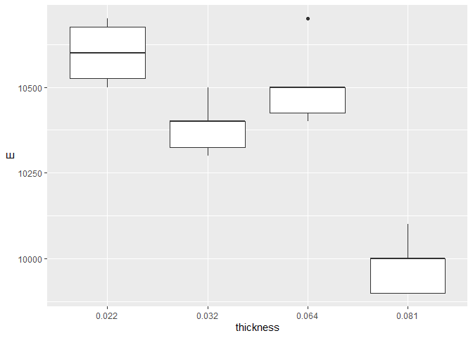
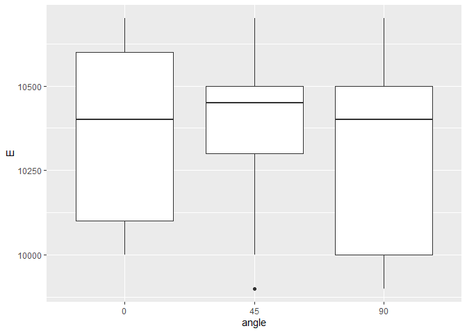
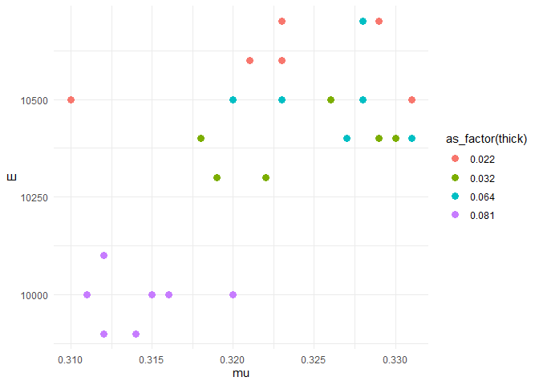

Aluminum Data
================
Lily Dao
2023-02-13

- <a href="#grading-rubric" id="toc-grading-rubric">Grading Rubric</a>
  - <a href="#individual" id="toc-individual">Individual</a>
  - <a href="#due-date" id="toc-due-date">Due Date</a>
- <a href="#loading-and-wrangle" id="toc-loading-and-wrangle">Loading and
  Wrangle</a>
  - <a
    href="#q1-tidy-df_stang-to-produce-df_stang_long-you-should-have-column-names-thick-alloy-angle-e-nu-make-sure-the-angle-variable-is-of-correct-type-filter-out-any-invalid-values"
    id="toc-q1-tidy-df_stang-to-produce-df_stang_long-you-should-have-column-names-thick-alloy-angle-e-nu-make-sure-the-angle-variable-is-of-correct-type-filter-out-any-invalid-values"><strong>q1</strong>
    Tidy <code>df_stang</code> to produce <code>df_stang_long</code>. You
    should have column names <code>thick, alloy, angle, E, nu</code>. Make
    sure the <code>angle</code> variable is of correct type. Filter out any
    invalid values.</a>
- <a href="#eda" id="toc-eda">EDA</a>
  - <a href="#initial-checks" id="toc-initial-checks">Initial checks</a>
    - <a
      href="#q2-perform-a-basic-eda-on-the-aluminum-data-without-visualization-use-your-analysis-to-answer-the-questions-under-observations-below-in-addition-add-your-own-specific-question-that-youd-like-to-answer-about-the-datayoull-answer-it-below-in-q3"
      id="toc-q2-perform-a-basic-eda-on-the-aluminum-data-without-visualization-use-your-analysis-to-answer-the-questions-under-observations-below-in-addition-add-your-own-specific-question-that-youd-like-to-answer-about-the-datayoull-answer-it-below-in-q3"><strong>q2</strong>
      Perform a basic EDA on the aluminum data <em>without visualization</em>.
      Use your analysis to answer the questions under <em>observations</em>
      below. In addition, add your own <em>specific</em> question that you’d
      like to answer about the data—you’ll answer it below in q3.</a>
  - <a href="#visualize" id="toc-visualize">Visualize</a>
    - <a
      href="#q3-create-a-visualization-to-investigate-your-question-from-q2-above-can-you-find-an-answer-to-your-question-using-the-dataset-would-you-need-additional-information-to-answer-your-question"
      id="toc-q3-create-a-visualization-to-investigate-your-question-from-q2-above-can-you-find-an-answer-to-your-question-using-the-dataset-would-you-need-additional-information-to-answer-your-question"><strong>q3</strong>
      Create a visualization to investigate your question from q2 above. Can
      you find an answer to your question using the dataset? Would you need
      additional information to answer your question?</a>
    - <a href="#q4-consider-the-following-statement"
      id="toc-q4-consider-the-following-statement"><strong>q4</strong>
      Consider the following statement:</a>
- <a href="#references" id="toc-references">References</a>

*Purpose*: When designing structures such as bridges, boats, and planes,
the design team needs data about *material properties*. Often when we
engineers first learn about material properties through coursework, we
talk about abstract ideas and look up values in tables without ever
looking at the data that gave rise to published properties. In this
challenge you’ll study an aluminum alloy dataset: Studying these data
will give you a better sense of the challenges underlying published
material values.

In this challenge, you will load a real dataset, wrangle it into tidy
form, and perform EDA to learn more about the data.

<!-- include-rubric -->

# Grading Rubric

<!-- -------------------------------------------------- -->

Unlike exercises, **challenges will be graded**. The following rubrics
define how you will be graded, both on an individual and team basis.

## Individual

<!-- ------------------------- -->

| Category    | Needs Improvement                                                                                                | Satisfactory                                                                                                               |
|-------------|------------------------------------------------------------------------------------------------------------------|----------------------------------------------------------------------------------------------------------------------------|
| Effort      | Some task **q**’s left unattempted                                                                               | All task **q**’s attempted                                                                                                 |
| Observed    | Did not document observations, or observations incorrect                                                         | Documented correct observations based on analysis                                                                          |
| Supported   | Some observations not clearly supported by analysis                                                              | All observations clearly supported by analysis (table, graph, etc.)                                                        |
| Assessed    | Observations include claims not supported by the data, or reflect a level of certainty not warranted by the data | Observations are appropriately qualified by the quality & relevance of the data and (in)conclusiveness of the support      |
| Specified   | Uses the phrase “more data are necessary” without clarification                                                  | Any statement that “more data are necessary” specifies which *specific* data are needed to answer what *specific* question |
| Code Styled | Violations of the [style guide](https://style.tidyverse.org/) hinder readability                                 | Code sufficiently close to the [style guide](https://style.tidyverse.org/)                                                 |

## Due Date

<!-- ------------------------- -->

All the deliverables stated in the rubrics above are due **at midnight**
before the day of the class discussion of the challenge. See the
[Syllabus](https://docs.google.com/document/d/1qeP6DUS8Djq_A0HMllMqsSqX3a9dbcx1/edit?usp=sharing&ouid=110386251748498665069&rtpof=true&sd=true)
for more information.

``` r
library(tidyverse)
```

    ## ── Attaching packages ─────────────────────────────────────── tidyverse 1.3.2 ──
    ## ✔ ggplot2 3.4.0      ✔ purrr   1.0.1 
    ## ✔ tibble  3.1.8      ✔ dplyr   1.0.10
    ## ✔ tidyr   1.2.1      ✔ stringr 1.5.0 
    ## ✔ readr   2.1.3      ✔ forcats 0.5.2 
    ## ── Conflicts ────────────────────────────────────────── tidyverse_conflicts() ──
    ## ✖ dplyr::filter() masks stats::filter()
    ## ✖ dplyr::lag()    masks stats::lag()

*Background*: In 1946, scientists at the Bureau of Standards tested a
number of Aluminum plates to determine their
[elasticity](https://en.wikipedia.org/wiki/Elastic_modulus) and
[Poisson’s ratio](https://en.wikipedia.org/wiki/Poisson%27s_ratio).
These are key quantities used in the design of structural members, such
as aircraft skin under [buckling
loads](https://en.wikipedia.org/wiki/Buckling). These scientists tested
plats of various thicknesses, and at different angles with respect to
the [rolling](https://en.wikipedia.org/wiki/Rolling_(metalworking))
direction.

# Loading and Wrangle

<!-- -------------------------------------------------- -->

The `readr` package in the Tidyverse contains functions to load data
form many sources. The `read_csv()` function will help us load the data
for this challenge.

``` r
## NOTE: If you extracted all challenges to the same location,
## you shouldn't have to change this filename
filename <- "./data/stang.csv"

## Load the data
df_stang <- read_csv(filename)
```

    ## Rows: 9 Columns: 8
    ## ── Column specification ────────────────────────────────────────────────────────
    ## Delimiter: ","
    ## chr (1): alloy
    ## dbl (7): thick, E_00, mu_00, E_45, mu_45, E_90, mu_90
    ## 
    ## ℹ Use `spec()` to retrieve the full column specification for this data.
    ## ℹ Specify the column types or set `show_col_types = FALSE` to quiet this message.

``` r
df_stang
```

    ## # A tibble: 9 × 8
    ##   thick  E_00 mu_00  E_45  mu_45  E_90 mu_90 alloy  
    ##   <dbl> <dbl> <dbl> <dbl>  <dbl> <dbl> <dbl> <chr>  
    ## 1 0.022 10600 0.321 10700  0.329 10500 0.31  al_24st
    ## 2 0.022 10600 0.323 10500  0.331 10700 0.323 al_24st
    ## 3 0.032 10400 0.329 10400  0.318 10300 0.322 al_24st
    ## 4 0.032 10300 0.319 10500  0.326 10400 0.33  al_24st
    ## 5 0.064 10500 0.323 10400  0.331 10400 0.327 al_24st
    ## 6 0.064 10700 0.328 10500  0.328 10500 0.32  al_24st
    ## 7 0.081 10000 0.315 10000  0.32   9900 0.314 al_24st
    ## 8 0.081 10100 0.312  9900  0.312 10000 0.316 al_24st
    ## 9 0.081 10000 0.311    -1 -1      9900 0.314 al_24st

Note that these data are not tidy! The data in this form are convenient
for reporting in a table, but are not ideal for analysis.

### **q1** Tidy `df_stang` to produce `df_stang_long`. You should have column names `thick, alloy, angle, E, nu`. Make sure the `angle` variable is of correct type. Filter out any invalid values.

*Hint*: You can reshape in one `pivot` using the `".value"` special
value for `names_to`.

``` r
## TASK: Tidy `df_stang`
df_stang_long <-
  df_stang %>%
    pivot_longer(
      names_to = c(".value", "angle"),
      names_sep = "_",
      cols = starts_with(c("E", "mu"))
    ) %>%
  mutate(angle = as.integer(angle)) %>% 
  filter(E > 0)
  
df_stang_long
```

    ## # A tibble: 26 × 5
    ##    thick alloy   angle     E    mu
    ##    <dbl> <chr>   <int> <dbl> <dbl>
    ##  1 0.022 al_24st     0 10600 0.321
    ##  2 0.022 al_24st    45 10700 0.329
    ##  3 0.022 al_24st    90 10500 0.31 
    ##  4 0.022 al_24st     0 10600 0.323
    ##  5 0.022 al_24st    45 10500 0.331
    ##  6 0.022 al_24st    90 10700 0.323
    ##  7 0.032 al_24st     0 10400 0.329
    ##  8 0.032 al_24st    45 10400 0.318
    ##  9 0.032 al_24st    90 10300 0.322
    ## 10 0.032 al_24st     0 10300 0.319
    ## # … with 16 more rows

Use the following tests to check your work.

``` r
## NOTE: No need to change this
## Names
assertthat::assert_that(
              setequal(
                df_stang_long %>% names,
                c("thick", "alloy", "angle", "E", "mu")
              )
            )
```

    ## [1] TRUE

``` r
## Dimensions
assertthat::assert_that(all(dim(df_stang_long) == c(26, 5)))
```

    ## [1] TRUE

``` r
## Type
assertthat::assert_that(
              (df_stang_long %>% pull(angle) %>% typeof()) == "integer"
            )
```

    ## [1] TRUE

``` r
print("Very good!")
```

    ## [1] "Very good!"

# EDA

<!-- -------------------------------------------------- -->

## Initial checks

<!-- ------------------------- -->

### **q2** Perform a basic EDA on the aluminum data *without visualization*. Use your analysis to answer the questions under *observations* below. In addition, add your own *specific* question that you’d like to answer about the data—you’ll answer it below in q3.

``` r
uni_alloy <- 
  distinct(df_stang_long,alloy)
uni_alloy
```

    ## # A tibble: 1 × 1
    ##   alloy  
    ##   <chr>  
    ## 1 al_24st

``` r
uni_angle <-
  distinct(df_stang_long, angle)
uni_angle
```

    ## # A tibble: 3 × 1
    ##   angle
    ##   <int>
    ## 1     0
    ## 2    45
    ## 3    90

``` r
uni_thickness <-
  distinct(df_stang_long, thick)
uni_thickness
```

    ## # A tibble: 4 × 1
    ##   thick
    ##   <dbl>
    ## 1 0.022
    ## 2 0.032
    ## 3 0.064
    ## 4 0.081

``` r
##
```

**Observations**:

- Is there “one true value” for the material properties of Aluminum?
  - There is not “one true value” for the material properties of
    aluminum, all the values seems to fluctuate with different variable
    changes.
- How many aluminum alloys are in this dataset? How do you know?
  - There is one aluminum alloy in this dataset and I know this through
    looking for distinct values down the “alloy” column. This yielded a
    1x1 table of one alloy. This means that there is only one alloy
    being tested.
- What angles were tested?
  - Three different angles were tested: 0 degrees, 45 degrees, and 90
    degrees. This was shown through looking at the distinct values in
    the “angle” column. This yielded a 3x1 table of three unique angles
    tested.
- What thicknesses were tested?
  - Four different thicknesses were tested: .022 in, .03 in, .064 in,
    and .081 in. This was shown through looking at the distinct values
    in the “thick” column. This yielded a 4x1 table of four unique
    thicknesses tested.
- My question: Does thickness or angle affect E more?

## Visualize

<!-- ------------------------- -->

### **q3** Create a visualization to investigate your question from q2 above. Can you find an answer to your question using the dataset? Would you need additional information to answer your question?

``` r
df_stang_long %>%
  mutate(thickness = as.character(thick)) %>%
  ggplot() +
  geom_boxplot(mapping = aes(x = thickness, y = E))
```

<!-- -->

``` r
df_stang_long %>%
  mutate(angle = as.character(angle)) %>% 
  ggplot() +
  geom_boxplot(mapping = aes(x = angle, y = E))
```

<!-- -->

``` r
## TASK: Investigate your question from q1 here
```

**Observations**:

- These graphs help me answer the question I posed: Does thickness or
  angle affect E more? From these graphs, I can say that we do see more
  of a correlation between E and thickness than between E and angle.
  There is a loose trend that as thickness increases, there is a
  decrease in the value of E, whereas it seems that the angle does not
  affect the value of E. This does give me an answer to my question,
  with the answer being that thickness affects E more, but there is
  nuance to this answer. There is not enough certainty to say that E is
  affected by thickness with 100% confidence, but if one were to affect
  E, it would be the thickness of the material and not the angle of it.

### **q4** Consider the following statement:

“A material’s property (or material property) is an intensive property
of some material, i.e. a physical property that does not depend on the
amount of the material.”\[2\]

Note that the “amount of material” would vary with the thickness of a
tested plate. Does the following graph support or contradict the claim
that “elasticity `E` is an intensive material property.” Why or why not?
Is this evidence *conclusive* one way or another? Why or why not?

``` r
## NOTE: No need to change; run this chunk
df_stang_long %>%

  ggplot(aes(mu, E, color = as_factor(thick))) +
  geom_point(size = 3) +
  theme_minimal()
```

<!-- -->

**Observations**:

- Does this graph support or contradict the claim above?
  - I would say that the graph above contradicts the claim that E is an
    intensive material property. This is because there seems to be a
    loose trend that as thickness increases, E decreases. This would
    mean that the physical property may have some dependency on the
    amount of material (thickness). Using purely this graph, the
    evidence is inconclusive because there is not a strong enough trend
    to say that the change in E is from thickness with certainty. While
    we do see some trend, we would hope to see a stronger trend (or more
    data points) to support or contradict this claim.

# References

<!-- -------------------------------------------------- -->

\[1\] Stang, Greenspan, and Newman, “Poisson’s ratio of some structural
alloys for large strains” (1946) Journal of Research of the National
Bureau of Standards, (pdf
link)\[<https://nvlpubs.nist.gov/nistpubs/jres/37/jresv37n4p211_A1b.pdf>\]

\[2\] Wikipedia, *List of material properties*, accessed 2020-06-26,
(link)\[<https://en.wikipedia.org/wiki/List_of_materials_properties>\]
