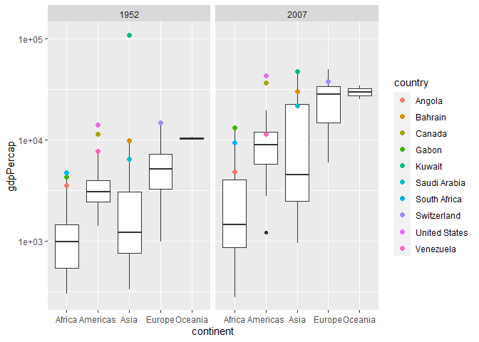

Gapminder
================
Lily Dao
2023-02-22

- <a href="#grading-rubric" id="toc-grading-rubric">Grading Rubric</a>
  - <a href="#individual" id="toc-individual">Individual</a>
  - <a href="#due-date" id="toc-due-date">Due Date</a>
- <a href="#guided-eda" id="toc-guided-eda">Guided EDA</a>
  - <a
    href="#q0-perform-your-first-checks-on-the-dataset-what-variables-are-in-this"
    id="toc-q0-perform-your-first-checks-on-the-dataset-what-variables-are-in-this"><strong>q0</strong>
    Perform your “first checks” on the dataset. What variables are in
    this</a>
  - <a
    href="#q1-determine-the-most-and-least-recent-years-in-the-gapminder-dataset"
    id="toc-q1-determine-the-most-and-least-recent-years-in-the-gapminder-dataset"><strong>q1</strong>
    Determine the most and least recent years in the <code>gapminder</code>
    dataset.</a>
  - <a
    href="#q2-filter-on-years-matching-year_min-and-make-a-plot-of-the-gdp-per-capita-against-continent-choose-an-appropriate-geom_-to-visualize-the-data-what-observations-can-you-make"
    id="toc-q2-filter-on-years-matching-year_min-and-make-a-plot-of-the-gdp-per-capita-against-continent-choose-an-appropriate-geom_-to-visualize-the-data-what-observations-can-you-make"><strong>q2</strong>
    Filter on years matching <code>year_min</code>, and make a plot of the
    GDP per capita against continent. Choose an appropriate
    <code>geom_</code> to visualize the data. What observations can you
    make?</a>
  - <a
    href="#q3-you-should-have-found-at-least-three-outliers-in-q2-but-possibly-many-more-identify-those-outliers-figure-out-which-countries-they-are"
    id="toc-q3-you-should-have-found-at-least-three-outliers-in-q2-but-possibly-many-more-identify-those-outliers-figure-out-which-countries-they-are"><strong>q3</strong>
    You should have found <em>at least</em> three outliers in q2 (but
    possibly many more!). Identify those outliers (figure out which
    countries they are).</a>
  - <a
    href="#q4-create-a-plot-similar-to-yours-from-q2-studying-both-year_min-and-year_max-find-a-way-to-highlight-the-outliers-from-q3-on-your-plot-in-a-way-that-lets-you-identify-which-country-is-which-compare-the-patterns-between-year_min-and-year_max"
    id="toc-q4-create-a-plot-similar-to-yours-from-q2-studying-both-year_min-and-year_max-find-a-way-to-highlight-the-outliers-from-q3-on-your-plot-in-a-way-that-lets-you-identify-which-country-is-which-compare-the-patterns-between-year_min-and-year_max"><strong>q4</strong>
    Create a plot similar to yours from q2 studying both
    <code>year_min</code> and <code>year_max</code>. Find a way to highlight
    the outliers from q3 on your plot <em>in a way that lets you identify
    which country is which</em>. Compare the patterns between
    <code>year_min</code> and <code>year_max</code>.</a>
- <a href="#your-own-eda" id="toc-your-own-eda">Your Own EDA</a>
  - <a
    href="#q5-create-at-least-three-new-figures-below-with-each-figure-try-to-pose-new-questions-about-the-data"
    id="toc-q5-create-at-least-three-new-figures-below-with-each-figure-try-to-pose-new-questions-about-the-data"><strong>q5</strong>
    Create <em>at least</em> three new figures below. With each figure, try
    to pose new questions about the data.</a>

*Purpose*: Learning to do EDA well takes practice! In this challenge
you’ll further practice EDA by first completing a guided exploration,
then by conducting your own investigation. This challenge will also give
you a chance to use the wide variety of visual tools we’ve been
learning.

<!-- include-rubric -->

# Grading Rubric

<!-- -------------------------------------------------- -->

Unlike exercises, **challenges will be graded**. The following rubrics
define how you will be graded, both on an individual and team basis.

## Individual

<!-- ------------------------- -->

| Category    | Needs Improvement                                                                                                | Satisfactory                                                                                                               |
|-------------|------------------------------------------------------------------------------------------------------------------|----------------------------------------------------------------------------------------------------------------------------|
| Effort      | Some task **q**’s left unattempted                                                                               | All task **q**’s attempted                                                                                                 |
| Observed    | Did not document observations, or observations incorrect                                                         | Documented correct observations based on analysis                                                                          |
| Supported   | Some observations not clearly supported by analysis                                                              | All observations clearly supported by analysis (table, graph, etc.)                                                        |
| Assessed    | Observations include claims not supported by the data, or reflect a level of certainty not warranted by the data | Observations are appropriately qualified by the quality & relevance of the data and (in)conclusiveness of the support      |
| Specified   | Uses the phrase “more data are necessary” without clarification                                                  | Any statement that “more data are necessary” specifies which *specific* data are needed to answer what *specific* question |
| Code Styled | Violations of the [style guide](https://style.tidyverse.org/) hinder readability                                 | Code sufficiently close to the [style guide](https://style.tidyverse.org/)                                                 |

## Due Date

<!-- ------------------------- -->

All the deliverables stated in the rubrics above are due **at midnight**
before the day of the class discussion of the challenge. See the
[Syllabus](https://docs.google.com/document/d/1qeP6DUS8Djq_A0HMllMqsSqX3a9dbcx1/edit?usp=sharing&ouid=110386251748498665069&rtpof=true&sd=true)
for more information.

``` r
library(tidyverse)
```

    ## ── Attaching packages ─────────────────────────────────────── tidyverse 1.3.2 ──
    ## ✔ ggplot2 3.4.0      ✔ purrr   1.0.1 
    ## ✔ tibble  3.1.8      ✔ dplyr   1.0.10
    ## ✔ tidyr   1.2.1      ✔ stringr 1.5.0 
    ## ✔ readr   2.1.3      ✔ forcats 0.5.2 
    ## ── Conflicts ────────────────────────────────────────── tidyverse_conflicts() ──
    ## ✖ dplyr::filter() masks stats::filter()
    ## ✖ dplyr::lag()    masks stats::lag()

``` r
library(gapminder)
```

*Background*: [Gapminder](https://www.gapminder.org/about-gapminder/) is
an independent organization that seeks to educate people about the state
of the world. They seek to counteract the worldview constructed by a
hype-driven media cycle, and promote a “fact-based worldview” by
focusing on data. The dataset we’ll study in this challenge is from
Gapminder.

# Guided EDA

<!-- -------------------------------------------------- -->

First, we’ll go through a round of *guided EDA*. Try to pay attention to
the high-level process we’re going through—after this guided round
you’ll be responsible for doing another cycle of EDA on your own!

### **q0** Perform your “first checks” on the dataset. What variables are in this

dataset?

``` r
df_q0 <-
  ls(gapminder)
df_q0
```

    ## [1] "continent" "country"   "gdpPercap" "lifeExp"   "pop"       "year"

``` r
gapminder
```

    ## # A tibble: 1,704 × 6
    ##    country     continent  year lifeExp      pop gdpPercap
    ##    <fct>       <fct>     <int>   <dbl>    <int>     <dbl>
    ##  1 Afghanistan Asia       1952    28.8  8425333      779.
    ##  2 Afghanistan Asia       1957    30.3  9240934      821.
    ##  3 Afghanistan Asia       1962    32.0 10267083      853.
    ##  4 Afghanistan Asia       1967    34.0 11537966      836.
    ##  5 Afghanistan Asia       1972    36.1 13079460      740.
    ##  6 Afghanistan Asia       1977    38.4 14880372      786.
    ##  7 Afghanistan Asia       1982    39.9 12881816      978.
    ##  8 Afghanistan Asia       1987    40.8 13867957      852.
    ##  9 Afghanistan Asia       1992    41.7 16317921      649.
    ## 10 Afghanistan Asia       1997    41.8 22227415      635.
    ## # … with 1,694 more rows

``` r
## TASK: Do your "first checks" here!
```

**Observations**:

- The variables in this data set are “continent”, “country”,
  “gdpPercap”, “lifeExp”, “pop”, and “year”.

### **q1** Determine the most and least recent years in the `gapminder` dataset.

*Hint*: Use the `pull()` function to get a vector out of a tibble.
(Rather than the `$` notation of base R.)

``` r
## TASK: Find the largest and smallest values of `year` in `gapminder`
years <- pull(gapminder, year)
year_max <- 
  max(years, na.rm = TRUE)
  year_max
```

    ## [1] 2007

``` r
year_min <- 
  min(years, na.rm = TRUE)
  year_min
```

    ## [1] 1952

Use the following test to check your work.

``` r
## NOTE: No need to change this
assertthat::assert_that(year_max %% 7 == 5)
```

    ## [1] TRUE

``` r
assertthat::assert_that(year_max %% 3 == 0)
```

    ## [1] TRUE

``` r
assertthat::assert_that(year_min %% 7 == 6)
```

    ## [1] TRUE

``` r
assertthat::assert_that(year_min %% 3 == 2)
```

    ## [1] TRUE

``` r
if (is_tibble(year_max)) {
  print("year_max is a tibble; try using `pull()` to get a vector")
  assertthat::assert_that(False)
}

print("Nice!")
```

    ## [1] "Nice!"

### **q2** Filter on years matching `year_min`, and make a plot of the GDP per capita against continent. Choose an appropriate `geom_` to visualize the data. What observations can you make?

You may encounter difficulties in visualizing these data; if so document
your challenges and attempt to produce the most informative visual you
can.

``` r
year_min_data <-
  gapminder %>%
  filter(year == year_min) %>%
  filter(gdpPercap <= 60000) %>%
  ggplot() +
    geom_boxplot(mapping = aes(continent, gdpPercap))
year_min_data
```

<!-- -->

**Observations**:

- Oceania has the highest GDP per capita on the metrics displayed from
  this boxplot (median, first quartile, third quartile). The median GDP
  per capita for Oceania was just over \$10,000 in 1952. The likely
  reason for Oceania having such a narrow distribution compared to the
  other continents is due to the couple countries that are a part of
  Oceania. This makes it so there aren’t many data points for Oceania.
  Europe follows Oceania with a median GDP per capita of just over
  \$5,000. Europe also has the largest distribution of data (excluding
  outliers). Africa, the Americas, and Asia have three outliers each and
  Europe has one outlier. Asia and Africa have similar medians that are
  the lowest for the continents.

**Difficulties & Approaches**:

- The main difficulty I faced while making this graph is that Asia had a
  significant outlier where in 1952 the GDP per capita was over
  \$100,000. Since most continents had a GDP per capita of under
  \$15,000, all the data was compressed to be able to fit this outlier.
  To be able to see most of the data in an informative manner, I took
  out this outlier. This allows us to see the distribution of the GDP
  per capita for the different continents.

### **q3** You should have found *at least* three outliers in q2 (but possibly many more!). Identify those outliers (figure out which countries they are).

``` r
outliers <-
  gapminder %>%
  filter(year == year_min) %>%
    filter(continent == "Africa", gdpPercap >= 3000)
  gapminder %>%
  filter(year == year_min) %>%
    filter(continent == "Asia", gdpPercap >= 6000)
```

    ## # A tibble: 3 × 6
    ##   country      continent  year lifeExp     pop gdpPercap
    ##   <fct>        <fct>     <int>   <dbl>   <int>     <dbl>
    ## 1 Bahrain      Asia       1952    50.9  120447     9867.
    ## 2 Kuwait       Asia       1952    55.6  160000   108382.
    ## 3 Saudi Arabia Asia       1952    39.9 4005677     6460.

``` r
  gapminder %>%
  filter(year == year_min) %>%
    filter(continent == "Americas", gdpPercap >= 7500)
```

    ## # A tibble: 3 × 6
    ##   country       continent  year lifeExp       pop gdpPercap
    ##   <fct>         <fct>     <int>   <dbl>     <int>     <dbl>
    ## 1 Canada        Americas   1952    68.8  14785584    11367.
    ## 2 United States Americas   1952    68.4 157553000    13990.
    ## 3 Venezuela     Americas   1952    55.1   5439568     7690.

``` r
  gapminder %>%
  filter(year == year_min) %>%
    filter(continent == "Europe", gdpPercap >= 12500)
```

    ## # A tibble: 1 × 6
    ##   country     continent  year lifeExp     pop gdpPercap
    ##   <fct>       <fct>     <int>   <dbl>   <int>     <dbl>
    ## 1 Switzerland Europe     1952    69.6 4815000    14734.

``` r
outliers
```

    ## # A tibble: 3 × 6
    ##   country      continent  year lifeExp      pop gdpPercap
    ##   <fct>        <fct>     <int>   <dbl>    <int>     <dbl>
    ## 1 Angola       Africa     1952    30.0  4232095     3521.
    ## 2 Gabon        Africa     1952    37.0   420702     4293.
    ## 3 South Africa Africa     1952    45.0 14264935     4725.

**Observations**:

- Identify the outlier countries from q2
  - By looking at the range of the distribution of data for each
    continent, I filtered out all data points that were above that range
    for each continent. I didn’t need to filter out data points below
    that range because the boxplot showed that there were no outliers on
    the lower end. From filtering this way, I found these of the be the
    outlier countries:
    - Africa: Angola, Gabon, South Africa

    - Americas: Canada, United States, Venezuela

    - Asia: Bahrain, Kuwait, Saudi Arabia

    - Europe: Switzerland

*Hint*: For the next task, it’s helpful to know a ggplot trick we’ll
learn in an upcoming exercise: You can use the `data` argument inside
any `geom_*` to modify the data that will be plotted *by that geom
only*. For instance, you can use this trick to filter a set of points to
label:

``` r
## NOTE: No need to edit, use ideas from this in q4 below
gapminder %>%
  filter(year == max(year)) %>%

  ggplot(aes(continent, lifeExp)) +
  geom_boxplot() +
  geom_point(
    data = . %>% filter(country %in% c("United Kingdom", "Japan", "Zambia")),
    mapping = aes(color = country),
    size = 2
  )
```

<!-- -->

### **q4** Create a plot similar to yours from q2 studying both `year_min` and `year_max`. Find a way to highlight the outliers from q3 on your plot *in a way that lets you identify which country is which*. Compare the patterns between `year_min` and `year_max`.

*Hint*: We’ve learned a lot of different ways to show multiple
variables; think about using different aesthetics or facets.

``` r
year_min_vs_max <-
  gapminder %>%
  filter(year == min(year) | year == max(year)) %>%
  filter(gdpPercap <= 60000) %>%
  ggplot(aes(continent, gdpPercap)) +
  geom_boxplot() +
  geom_point(
    data = . %>% filter(country %in% c("Angola", "Gabon", "Bahrain", "Saudi Arabia", "Kuwait", "United States", "Canada", "Venezuela", "Switzerland", "South Africa")),
    mapping = aes(color = country),
    size = 2
  ) +
  facet_grid(~year)
year_min_vs_max
```

<!-- -->

**Observations**:

- A major difference between the data of these two years is that the
  spread of data for each continent is larger. Asia had an IQR of about
  \$20,000 in 2007 and its IQR was about \$2,500 in 1952. This would
  lead me to believe that some countries began developing rapidly
  whereas some countries were slower to develop. Generally, the
  continents have a higher GDP per capita, with Africa’s GDP per capita
  being the most similar between the two years we are observing. Some
  outlier countries we saw in 1952 that had a major increase in GDP per
  capita by 2007 (\>\$10,000) include Canada, United States, Saudi
  Arabia, Bahrain, and Switzerland. Kuwait is still an outlier in Asia,
  but it now fits on the graph, showing that the GDP per capita in
  Kuwait dropped a significant amount between 1952 and 2007. Oceania
  still doesn’t have any outliers but it does have a greater spread of
  data. There are only a few additional outliers in the data in 2007
  that weren’t outliers in 1952 and they are all in Africa.

# Your Own EDA

<!-- -------------------------------------------------- -->

Now it’s your turn! We just went through guided EDA considering the GDP
per capita at two time points. You can continue looking at outliers,
consider different years, repeat the exercise with `lifeExp`, consider
the relationship between variables, or something else entirely.

### **q5** Create *at least* three new figures below. With each figure, try to pose new questions about the data.

``` r
asia_outliers_gdp_vs_year <-
  gapminder %>%
  filter(country == "Kuwait" | country == "Bahrain"| country == "Saudi Arabia") %>%
  ggplot() +
  geom_line(mapping = aes(year, gdpPercap, color = country))
asia_outliers_gdp_vs_year
```

<!-- -->

- When making this graph, I was curious if we would see similar patterns
  between the three outlier countries in Asia. Kuwait showed an
  abnormally high GDP per capita in 1952 then dropped off, which made me
  curious as to what the outlier countries looked like over time. From
  this graph, it seems that Kuwait had a separate reason for such a high
  GDP per capita that did not affect other countries in Asia. When
  Kuwait’s GDP per capita rose and fell, we don’t necessarily see the
  same patterns with Bahrain and Saudi Arabia. While both Bahrain and
  Saudi Arabia had an increased GDP per capita between 1952 and 2007,
  both had a relatively low change compared to Kuwait. Kuwait
  experienced a major drop around 1982 that put the country’s GDP per
  capita in a similar range to Bahrain and Saudi Arabia.

``` r
year_min_max_lifeexp <-
  gapminder %>%
  filter(year == min(year) | year == max(year)) %>%
  ggplot(aes(continent, lifeExp)) +
  geom_boxplot() +
  facet_grid(~year)
year_min_max_lifeexp
```

<!-- -->

- When making this graph, I was curious what life expectancy looked like
  between the continents and if this graph would look similar to the GDP
  per capita vs. continent graph. There are many similarities between
  the GDP per capita graph and the life expectancy graph. Both graphs
  generally see an increase in the median value that is being measured
  and we also see approximately the same pattern in terms of lowest to
  highest median. Oceania ranks the highest, followed by Europe, the
  Americas, Asia, then Africa. Unlike the GDP per capita graph, the
  spread of the data between the two years seems to be similar, which
  makes sense as we are measuring age and not a more volatile value like
  money. An interesting thing to note about these two years is that in
  1952, Africa and Europe both have an outlier but neither have an
  outlier in 2007. On the other hand, the Americas and Asia have an
  outlier in 2007 but neither have an outlier in 1952.

``` r
second_european_country <-
  gapminder %>%
  filter(continent == "Europe" & year == 1952) %>%
  arrange(desc(gdpPercap))
second_european_country
```

    ## # A tibble: 30 × 6
    ##    country        continent  year lifeExp      pop gdpPercap
    ##    <fct>          <fct>     <int>   <dbl>    <int>     <dbl>
    ##  1 Switzerland    Europe     1952    69.6  4815000    14734.
    ##  2 Norway         Europe     1952    72.7  3327728    10095.
    ##  3 United Kingdom Europe     1952    69.2 50430000     9980.
    ##  4 Denmark        Europe     1952    70.8  4334000     9692.
    ##  5 Netherlands    Europe     1952    72.1 10381988     8942.
    ##  6 Sweden         Europe     1952    71.9  7124673     8528.
    ##  7 Belgium        Europe     1952    68    8730405     8343.
    ##  8 Iceland        Europe     1952    72.5   147962     7268.
    ##  9 Germany        Europe     1952    67.5 69145952     7144.
    ## 10 France         Europe     1952    67.4 42459667     7030.
    ## # … with 20 more rows

``` r
top_compared_to_oceania <-
  gapminder %>%
  filter(continent == "Oceania" | country == "South Africa" | country == "Gabon" | country == "United States" | country == "Canada" | country == "Bahrain" | country == "Kuwait" | country == "Switzerland" | country == "Norway") %>%
  ggplot() +
  geom_line(mapping = aes(year, gdpPercap, group = country, color = continent))

top_compared_to_oceania
```

<!-- -->

- I made this graph to better understand where Oceania fit in the larger
  scale of things, specifically where its two countries compared to the
  top two countries (in 1952) over time. This allows us to place Oceania
  more accurately than a boxplot may since boxplots make Oceania seem
  like the superior continent in terms of GDP per capita. From this
  graph, we can see that Oceania’s two countries sit in about the middle
  of the other continent’s top two countries. Australia and New Zealand
  are generally below the United States, Canada, Kuwait, Switzerland,
  and Norway. Their GDP per capita is not as impressive when looking at
  in this form of graph, which shows the importance of looking at data
  from several different angles. From looking at the data this way, we
  can see that while Australia and New Zealand have relatively high GDPs
  per capita compared to all other countries, they are fairly average
  compared to the top of the other continents.
