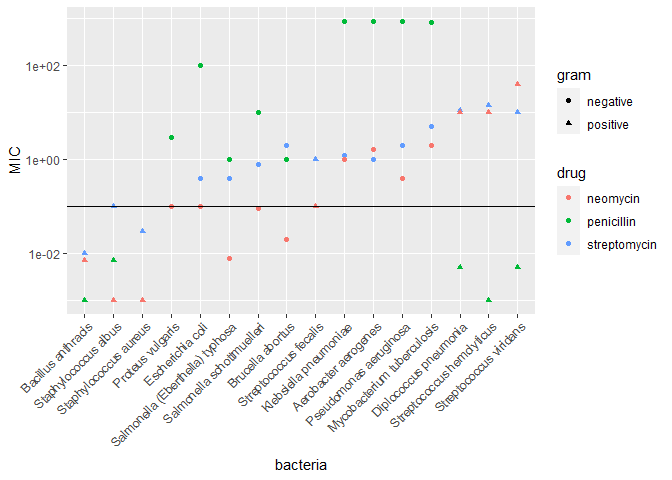
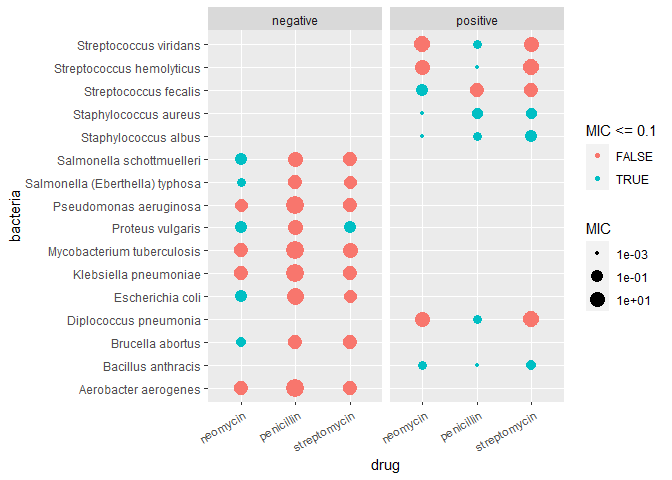

Antibiotics
================
Lily Dao
2023-02-27

*Purpose*: Creating effective data visualizations is an *iterative*
process; very rarely will the first graph you make be the most
effective. The most effective thing you can do to be successful in this
iterative process is to *try multiple graphs* of the same data.

Furthermore, judging the effectiveness of a visual is completely
dependent on *the question you are trying to answer*. A visual that is
totally ineffective for one question may be perfect for answering a
different question.

In this challenge, you will practice *iterating* on data visualization,
and will anchor the *assessment* of your visuals using two different
questions.

*Note*: Please complete your initial visual design **alone**. Work on
both of your graphs alone, and save a version to your repo *before*
coming together with your team. This way you can all bring a diversity
of ideas to the table!

<!-- include-rubric -->

# Grading Rubric

<!-- -------------------------------------------------- -->

Unlike exercises, **challenges will be graded**. The following rubrics
define how you will be graded, both on an individual and team basis.

## Individual

<!-- ------------------------- -->

| Category    | Needs Improvement                                                                                                | Satisfactory                                                                                                               |
|-------------|------------------------------------------------------------------------------------------------------------------|----------------------------------------------------------------------------------------------------------------------------|
| Effort      | Some task **q**’s left unattempted                                                                               | All task **q**’s attempted                                                                                                 |
| Observed    | Did not document observations, or observations incorrect                                                         | Documented correct observations based on analysis                                                                          |
| Supported   | Some observations not clearly supported by analysis                                                              | All observations clearly supported by analysis (table, graph, etc.)                                                        |
| Assessed    | Observations include claims not supported by the data, or reflect a level of certainty not warranted by the data | Observations are appropriately qualified by the quality & relevance of the data and (in)conclusiveness of the support      |
| Specified   | Uses the phrase “more data are necessary” without clarification                                                  | Any statement that “more data are necessary” specifies which *specific* data are needed to answer what *specific* question |
| Code Styled | Violations of the [style guide](https://style.tidyverse.org/) hinder readability                                 | Code sufficiently close to the [style guide](https://style.tidyverse.org/)                                                 |

## Due Date

<!-- ------------------------- -->

All the deliverables stated in the rubrics above are due **at midnight**
before the day of the class discussion of the challenge. See the
[Syllabus](https://docs.google.com/document/d/1qeP6DUS8Djq_A0HMllMqsSqX3a9dbcx1/edit?usp=sharing&ouid=110386251748498665069&rtpof=true&sd=true)
for more information.

``` r
library(tidyverse)
```

    ## ── Attaching packages ─────────────────────────────────────── tidyverse 1.3.2 ──
    ## ✔ ggplot2 3.4.0      ✔ purrr   1.0.1 
    ## ✔ tibble  3.1.8      ✔ dplyr   1.0.10
    ## ✔ tidyr   1.2.1      ✔ stringr 1.5.0 
    ## ✔ readr   2.1.3      ✔ forcats 0.5.2 
    ## ── Conflicts ────────────────────────────────────────── tidyverse_conflicts() ──
    ## ✖ dplyr::filter() masks stats::filter()
    ## ✖ dplyr::lag()    masks stats::lag()

``` r
library(ggrepel)
```

*Background*: The data\[1\] we study in this challenge report the
[*minimum inhibitory
concentration*](https://en.wikipedia.org/wiki/Minimum_inhibitory_concentration)
(MIC) of three drugs for different bacteria. The smaller the MIC for a
given drug and bacteria pair, the more practical the drug is for
treating that particular bacteria. An MIC value of *at most* 0.1 is
considered necessary for treating human patients.

These data report MIC values for three antibiotics—penicillin,
streptomycin, and neomycin—on 16 bacteria. Bacteria are categorized into
a genus based on a number of features, including their resistance to
antibiotics.

``` r
## NOTE: If you extracted all challenges to the same location,
## you shouldn't have to change this filename
filename <- "./data/antibiotics.csv"

## Load the data
df_antibiotics <- read_csv(filename)
```

    ## Rows: 16 Columns: 5
    ## ── Column specification ────────────────────────────────────────────────────────
    ## Delimiter: ","
    ## chr (2): bacteria, gram
    ## dbl (3): penicillin, streptomycin, neomycin
    ## 
    ## ℹ Use `spec()` to retrieve the full column specification for this data.
    ## ℹ Specify the column types or set `show_col_types = FALSE` to quiet this message.

``` r
df_antibiotics %>% knitr::kable()
```

| bacteria                        | penicillin | streptomycin | neomycin | gram     |
|:--------------------------------|-----------:|-------------:|---------:|:---------|
| Aerobacter aerogenes            |    870.000 |         1.00 |    1.600 | negative |
| Brucella abortus                |      1.000 |         2.00 |    0.020 | negative |
| Bacillus anthracis              |      0.001 |         0.01 |    0.007 | positive |
| Diplococcus pneumonia           |      0.005 |        11.00 |   10.000 | positive |
| Escherichia coli                |    100.000 |         0.40 |    0.100 | negative |
| Klebsiella pneumoniae           |    850.000 |         1.20 |    1.000 | negative |
| Mycobacterium tuberculosis      |    800.000 |         5.00 |    2.000 | negative |
| Proteus vulgaris                |      3.000 |         0.10 |    0.100 | negative |
| Pseudomonas aeruginosa          |    850.000 |         2.00 |    0.400 | negative |
| Salmonella (Eberthella) typhosa |      1.000 |         0.40 |    0.008 | negative |
| Salmonella schottmuelleri       |     10.000 |         0.80 |    0.090 | negative |
| Staphylococcus albus            |      0.007 |         0.10 |    0.001 | positive |
| Staphylococcus aureus           |      0.030 |         0.03 |    0.001 | positive |
| Streptococcus fecalis           |      1.000 |         1.00 |    0.100 | positive |
| Streptococcus hemolyticus       |      0.001 |        14.00 |   10.000 | positive |
| Streptococcus viridans          |      0.005 |        10.00 |   40.000 | positive |

# Visualization

<!-- -------------------------------------------------- -->

### **q1** Prototype 5 visuals

To start, construct **5 qualitatively different visualizations of the
data** `df_antibiotics`. These **cannot** be simple variations on the
same graph; for instance, if two of your visuals could be made identical
by calling `coord_flip()`, then these are *not* qualitatively different.

For all five of the visuals, you must show information on *all 16
bacteria*. For the first two visuals, you must *show all variables*.

*Hint 1*: Try working quickly on this part; come up with a bunch of
ideas, and don’t fixate on any one idea for too long. You will have a
chance to refine later in this challenge.

*Hint 2*: The data `df_antibiotics` are in a *wide* format; it may be
helpful to `pivot_longer()` the data to make certain visuals easier to
construct.

#### Visual 1 (All variables)

In this visual you must show *all three* effectiveness values for *all
16 bacteria*. You must also show whether or not each bacterium is Gram
positive or negative.

``` r
df_antibiotics %>%
  pivot_longer(
    names_to = "drug",
    values_to = "MIC",
    c('penicillin', 'streptomycin', 'neomycin')
  ) %>%
  
  mutate(bacteria = fct_reorder(bacteria, MIC)) %>% 
  
  ggplot() +
  geom_point(mapping = aes(x = bacteria, y = MIC, color = drug, shape = gram)) +
  scale_y_log10() +
  geom_hline(yintercept = 0.1) +
  theme(axis.text.x = element_text(angle = 45, vjust = 1, hjust = 1))
```

<!-- -->

#### Visual 2 (All variables)

In this visual you must show *all three* effectiveness values for *all
16 bacteria*. You must also show whether or not each bacterium is Gram
positive or negative.

Note that your visual must be *qualitatively different* from *all* of
your other visuals.

``` r
df_antibiotics %>%
  pivot_longer(
    names_to = "drug",
    values_to = "MIC",
    c('penicillin', 'streptomycin', 'neomycin')
  ) %>%
  ggplot() +
  geom_count(mapping = aes(x = bacteria, y = drug, shape = factor(gram), size = MIC, group = MIC, color = MIC <= 0.1)) +
  scale_size(trans = "log10") +
  theme(axis.text.x = element_text(angle = 45, vjust = 1, hjust = 1))
```

<!-- -->

#### Visual 3 (Some variables)

In this visual you may show a *subset* of the variables (`penicillin`,
`streptomycin`, `neomycin`, `gram`), but you must still show *all 16
bacteria*.

Note that your visual must be *qualitatively different* from *all* of
your other visuals.

``` r
df_penicillin <-
  df_antibiotics %>%
  select(c("bacteria", "penicillin", "gram")) %>%
  arrange(penicillin)
df_penicillin_order <-
  df_penicillin %>%
    ggplot() +
    scale_y_log10() +
    geom_point(mapping = aes(bacteria, penicillin, color = penicillin <= 0.1))+
    theme(axis.text.x = element_text(angle = 45, vjust = 1, hjust = 1, size = 8)) +
    facet_grid(~ gram)
df_penicillin_order
```

<!-- -->

#### Visual 4 (Some variables)

In this visual you may show a *subset* of the variables (`penicillin`,
`streptomycin`, `neomycin`, `gram`), but you must still show *all 16
bacteria*.

Note that your visual must be *qualitatively different* from *all* of
your other visuals.

``` r
df_box <-
  df_antibiotics %>%
  pivot_longer(
    names_to = "drug",
    values_to = "MIC",
    c('penicillin', 'streptomycin', 'neomycin'),
  ) %>%
  ggplot() +
  geom_boxplot(mapping = aes(bacteria, MIC, color = gram)) +
  scale_y_log10() +
  theme(axis.text.x = element_text(angle = 45, vjust = 1, hjust = 1, size = 7)) +
  geom_hline(yintercept = 0.1) 
df_box
```

<!-- -->

#### Visual 5 (Some variables)

In this visual you may show a *subset* of the variables (`penicillin`,
`streptomycin`, `neomycin`, `gram`), but you must still show *all 16
bacteria*.

Note that your visual must be *qualitatively different* from *all* of
your other visuals.

``` r
df_smallest_mic <-
  df_antibiotics %>%
  pivot_longer(
    names_to = "drug",
    values_to = "MIC",
    c('penicillin', 'streptomycin', 'neomycin')
  ) %>%
  group_by(bacteria) %>%
  arrange(bacteria, MIC) %>%
  slice(1) %>%
  mutate(gram = ifelse(gram == "positive", "+", gram)) %>%
  mutate(gram = ifelse(gram == "negative", "-", gram)) %>%
  ggplot() +
  scale_y_sqrt() +
  geom_col(mapping = aes(bacteria, MIC, fill = drug)) +
  theme(axis.text.x = element_text(angle = 45, vjust = 1, hjust = 1, size = 7.5)) +
  geom_hline(yintercept = 0.1) +
  geom_text(aes(bacteria, MIC, label = gram))
df_smallest_mic
```

<!-- -->

### **q2** Assess your visuals

There are **two questions** below; use your five visuals to help answer
both Guiding Questions. Note that you must also identify which of your
five visuals were most helpful in answering the questions.

*Hint 1*: It’s possible that *none* of your visuals is effective in
answering the questions below. You may need to revise one or more of
your visuals to answer the questions below!

*Hint 2*: It’s **highly unlikely** that the same visual is the most
effective at helping answer both guiding questions. **Use this as an
opportunity to think about why this is.**

#### Guiding Question 1

> How do the three antibiotics vary in their effectiveness against
> bacteria of different genera and Gram stain?

*Observations* - What is your response to the question above?

Neomycin was overall the most effective against bacteria, having an MIC
value less than or equal to 0.1 for nine types of bacteria. This was
followed with penicillin at six types then streptomycin with four types.
Penicillin generally seems like the best drug to combat strep while all
drugs combat staph infection well. Neomycin was the only drug effective
for the salmonella genera. In terms of the effectiveness of the drugs
with relation to Gram stain, penicillin and streptomycin are only effect
against Gram Positive bacteria with the exception of Proteus vulgaris
for streptomycin. On the other hand, neomycin did not show a definitive
answer on which Gram stain the drug tends to be more effective against.
Neomycin is the best all around drug considering it is effective against
the most bacteria and can combat Gram negative bacteria, but each drug
also has their distinct use cases.

Which of your visuals above (1 through 5) is **most effective** at
helping to answer this question?

I found that my second visual was the most effective at helping answer
this question.

Why?

I found my second visual most effective because I could distinctly see
whether a drug was effective and what Gram stain the bacteria was. The
information wasn’t too difficult to decipher and the axes were clear to
read. The only other two graphs I could consider were my first and fifth
graphs. I didn’t find my first graph the most effective because Gram
value was more difficult to see and my bacteria was no longer in the
order the data set gave me. Since the bacteria wasn’t in order, I
couldn’t easily see any distinct patterns regarding bacteria genera. As
for the fifth graph, it only shows the most effective drug against each
bacteria, which doesn’t allow me to see if other drugs were effective
just with a higher MIC value. Out of my visuals, my second visual didn’t
compromise any information and let me see patterns regarding the
effectiveness of drugs the most clearly.

#### Guiding Question 2

In 1974 *Diplococcus pneumoniae* was renamed *Streptococcus pneumoniae*,
and in 1984 *Streptococcus fecalis* was renamed *Enterococcus fecalis*
\[2\].

> Why was *Diplococcus pneumoniae* was renamed *Streptococcus
> pneumoniae*?

*Observations* - What is your response to the question above?

From the data, it seems that Diplococcus pneumoniae was renamed to
Streptococcus pneumoniae because it follows many of the same patterns as
other bacteria that are part of the Streptococcus genera. Diplococcus
pneumoniae is a Gram Positive bacteria that is only effectively treated
by penicillin out of the three drugs tested. Furthermore, Diplococcus
has similar MIC values for neomycin and streptomycin compared to the
other bacteria that are a part of the Streptococcus genera.

Which of your visuals above (1 through 5) is **most effective** at
helping to answer this question?

My first visual was definitely the most effective at answering this
question.

Why?

The first visual clearly indicates that there could be some pattern with
Diplococcus pneumoniae and the Streptococcus genera because they are set
apart from the rest of the data. On the far bottom right corner of this
graph, you see three green triangles clustered. This is because
penicillin is effective on all three types of bacteria and the bacteria
are all Gram Positive. The graph is specifically trying to order the
bacteria in such a way that the MIC values are ascending roughly. This
means that the three bacteria we’re looking at are similar in MIC, even
outside of penicillin. The other graphs aren’t as effective because you
can’t see how similar Diplococcus pneumoniae is to the Streptococcus
genera as easily or at all. With the fifth graph, we can’t see how
similar the streptomycin and neomycin MIC values for the bacteria are.
In the fourth, the boxplots show many similarities between the three
bacteria, but you can’t see which drug is most effective. In the third
graph, Diplococcus pneumoniae doesn’t stand out from the other bacteria
treated with penicillin so there is no apparent pattern. In the second
graph, you can reach the conclusion that there may be a relation between
the three bacteria, but the fact that they are not beside each other on
the x-axis makes this difficult to see.

# References

<!-- -------------------------------------------------- -->

\[1\] Neomycin in skin infections: A new topical antibiotic with wide
antibacterial range and rarely sensitizing. Scope. 1951;3(5):4-7.

\[2\] Wainer and Lysen, “That’s Funny…” *American Scientist* (2009)
[link](https://www.americanscientist.org/article/thats-funny)
