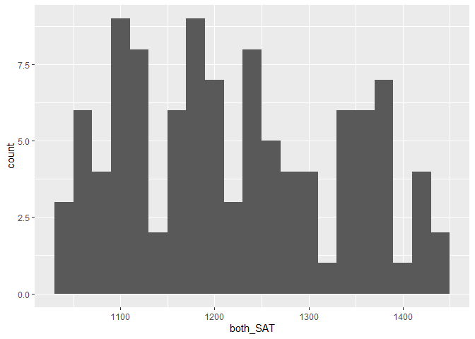

SAT and College Grades
================
Lily Dao
2023-04-10

- <a href="#grading-rubric" id="toc-grading-rubric">Grading Rubric</a>
  - <a href="#individual" id="toc-individual">Individual</a>
  - <a href="#due-date" id="toc-due-date">Due Date</a>
- <a href="#obtain-the-data" id="toc-obtain-the-data">Obtain the Data</a>
  - <a
    href="#q1-visit-the-sat-and-college-gpa-case-study-page-scroll-to-the-bottom-and-click-the-open-data-with-excel-button-this-will-allow-you-to-download-an-xls-file-save-the-file-to-your-data-folder-load-the-data-as-df_sat-and-perform-your-first-checks-against-these-data-answer-the-questions-below"
    id="toc-q1-visit-the-sat-and-college-gpa-case-study-page-scroll-to-the-bottom-and-click-the-open-data-with-excel-button-this-will-allow-you-to-download-an-xls-file-save-the-file-to-your-data-folder-load-the-data-as-df_sat-and-perform-your-first-checks-against-these-data-answer-the-questions-below"><strong>q1</strong>
    Visit the SAT and College GPA case study page, scroll to the bottom, and
    click the <code>Open Data with Excel</code> button. This will allow you
    to download an <code>xls</code> file. Save the file to your
    <code>data</code> folder, load the data as <code>df_sat</code>, and
    perform your “first checks” against these data. Answer the questions
    below:</a>
- <a href="#analysis-with-hypothesis-testing"
  id="toc-analysis-with-hypothesis-testing">Analysis with Hypothesis
  Testing</a>
  - <a href="#view-1-correlations" id="toc-view-1-correlations">View 1:
    Correlations</a>
    - <a
      href="#q2-create-a-single-plot-that-shows-univ_gpa-against-both-high_gpa-and-both_sat-visually-compare-the-two-trends"
      id="toc-q2-create-a-single-plot-that-shows-univ_gpa-against-both-high_gpa-and-both_sat-visually-compare-the-two-trends"><strong>q2</strong>
      Create a <em>single</em> plot that shows <code>univ_GPA</code> against
      <em>both</em> <code>high_GPA</code> and <code>both_SAT</code>. Visually
      compare the two trends.</a>
    - <a href="#hypothesis-testing-with-a-correlation-coefficient"
      id="toc-hypothesis-testing-with-a-correlation-coefficient">Hypothesis
      Testing with a Correlation Coefficient</a>
    - <a
      href="#q3-plot-histograms-for-both_sat-high_gpa-univ_gpa-whichif-anyof-the-variables-look-approximately-normally-distributed"
      id="toc-q3-plot-histograms-for-both_sat-high_gpa-univ_gpa-whichif-anyof-the-variables-look-approximately-normally-distributed"><strong>q3</strong>
      Plot histograms for <code>both_SAT, high_GPA, univ_GPA</code>. Which—if
      any—of the variables look approximately normally distributed.</a>
    - <a
      href="#q4-use-the-function-cortest-to-construct-confidence-intervals-for-corrhigh_gpa-univ_gpa-and-corrboth_sat-univ_gpa-answer-the-questions-below"
      id="toc-q4-use-the-function-cortest-to-construct-confidence-intervals-for-corrhigh_gpa-univ_gpa-and-corrboth_sat-univ_gpa-answer-the-questions-below"><strong>q4</strong>
      Use the function <code>cor.test()</code> to construct confidence
      intervals for <code>corr[high_GPA, univ_GPA</code> and
      <code>corr[both_SAT, univ_GPA]</code>. Answer the questions below.</a>
    - <a
      href="#q5-use-the-bootstrap-to-approximate-a-confidence-interval-for-corrhigh_gpa-univ_gpa-compare-your-resultsboth-the-estimate-and-confidence-intervalto-your-results-from-q4"
      id="toc-q5-use-the-bootstrap-to-approximate-a-confidence-interval-for-corrhigh_gpa-univ_gpa-compare-your-resultsboth-the-estimate-and-confidence-intervalto-your-results-from-q4"><strong>q5</strong>
      Use the bootstrap to approximate a confidence interval for
      <code>corr[high_GPA, univ_GPA</code>. Compare your results—both the
      estimate and confidence interval—to your results from q4.</a>
  - <a href="#view-2-modeling" id="toc-view-2-modeling">View 2: Modeling</a>
    - <a href="#hypothesis-testing-with-a-model"
      id="toc-hypothesis-testing-with-a-model">Hypothesis Testing with a
      Model</a>
    - <a
      href="#q6-fit-a-linear-model-predicting-univ_gpa-with-the-predictor-both_sat-assess-the-model-to-determine-how-effective-a-predictor-both_sat-is-for-univ_gpa-interpret-the-resulting-confidence-interval-for-the-coefficient-on-both_sat"
      id="toc-q6-fit-a-linear-model-predicting-univ_gpa-with-the-predictor-both_sat-assess-the-model-to-determine-how-effective-a-predictor-both_sat-is-for-univ_gpa-interpret-the-resulting-confidence-interval-for-the-coefficient-on-both_sat"><strong>q6</strong>
      Fit a linear model predicting <code>univ_GPA</code> with the predictor
      <code>both_SAT</code>. Assess the model to determine how effective a
      predictor <code>both_SAT</code> is for <code>univ_GPA</code>. Interpret
      the resulting confidence interval for the coefficient on
      <code>both_SAT</code>.</a>
    - <a
      href="#q7-fit-a-model-predicting-univ_gpa-using-both-high_gpa-and-both_sat-compare-the-prediction-accuracy-and-hypothesis-test-results"
      id="toc-q7-fit-a-model-predicting-univ_gpa-using-both-high_gpa-and-both_sat-compare-the-prediction-accuracy-and-hypothesis-test-results"><strong>q7</strong>
      Fit a model predicting <code>univ_GPA</code> using both
      <code>high_GPA</code> and <code>both_SAT</code>. Compare the prediction
      accuracy and hypothesis test results.</a>
  - <a href="#synthesize" id="toc-synthesize">Synthesize</a>
    - <a
      href="#q8-using-the-results-from-all-previous-qs-answer-the-following-questions"
      id="toc-q8-using-the-results-from-all-previous-qs-answer-the-following-questions"><strong>q8</strong>
      Using the results from all previous q’s, answer the following
      questions.</a>
- <a href="#end-notes" id="toc-end-notes">End Notes</a>

*Purpose*: How do we apply hypothesis testing to investigating data? In
this challenge you’ll practice using hypothesis testing tools to make
sense of a dataset.

*Reading*: - [Harvard Study Says SATs Should Be Optional: Here’s
Why](https://www.csmonitor.com/USA/USA-Update/2016/0120/Harvard-study-says-SATs-should-be-optional.-Here-s-why)
(Optional); easy-to-read news article on colleges going SAT-free -
[Norm-Referenced Tests and Race-Blind
Admissions](https://cshe.berkeley.edu/publications/norm-referenced-tests-and-race-blind-admissions-case-eliminating-sat-and-act-university)
(Optional); technical report on relationship between the SAT/ACT and
non-academic factors

*Credit*: This is based on a [case
study](http://onlinestatbook.com/2/case_studies/sat.html) originally
prepared by Emily Zitek, with data collected through the research of
Thomas MacFarland.

``` r
library(tidyverse)
```

    ## ── Attaching packages ─────────────────────────────────────── tidyverse 1.3.2 ──
    ## ✔ ggplot2 3.4.0      ✔ purrr   1.0.1 
    ## ✔ tibble  3.1.8      ✔ dplyr   1.0.10
    ## ✔ tidyr   1.2.1      ✔ stringr 1.5.0 
    ## ✔ readr   2.1.3      ✔ forcats 0.5.2 
    ## ── Conflicts ────────────────────────────────────────── tidyverse_conflicts() ──
    ## ✖ dplyr::filter() masks stats::filter()
    ## ✖ dplyr::lag()    masks stats::lag()

``` r
library(readxl)
library(broom)
library(modelr)
```

    ## 
    ## Attaching package: 'modelr'
    ## 
    ## The following object is masked from 'package:broom':
    ## 
    ##     bootstrap

``` r
library(rsample)
```

<!-- include-rubric -->

# Grading Rubric

<!-- -------------------------------------------------- -->

Unlike exercises, **challenges will be graded**. The following rubrics
define how you will be graded, both on an individual and team basis.

## Individual

<!-- ------------------------- -->

| Category    | Needs Improvement                                                                                                | Satisfactory                                                                                                               |
|-------------|------------------------------------------------------------------------------------------------------------------|----------------------------------------------------------------------------------------------------------------------------|
| Effort      | Some task **q**’s left unattempted                                                                               | All task **q**’s attempted                                                                                                 |
| Observed    | Did not document observations, or observations incorrect                                                         | Documented correct observations based on analysis                                                                          |
| Supported   | Some observations not clearly supported by analysis                                                              | All observations clearly supported by analysis (table, graph, etc.)                                                        |
| Assessed    | Observations include claims not supported by the data, or reflect a level of certainty not warranted by the data | Observations are appropriately qualified by the quality & relevance of the data and (in)conclusiveness of the support      |
| Specified   | Uses the phrase “more data are necessary” without clarification                                                  | Any statement that “more data are necessary” specifies which *specific* data are needed to answer what *specific* question |
| Code Styled | Violations of the [style guide](https://style.tidyverse.org/) hinder readability                                 | Code sufficiently close to the [style guide](https://style.tidyverse.org/)                                                 |

## Due Date

<!-- ------------------------- -->

All the deliverables stated in the rubrics above are due **at midnight**
before the day of the class discussion of the challenge. See the
[Syllabus](https://docs.google.com/document/d/1qeP6DUS8Djq_A0HMllMqsSqX3a9dbcx1/edit?usp=sharing&ouid=110386251748498665069&rtpof=true&sd=true)
for more information.

*Background*: Every year about 2 million students take the Scholastic
Aptitude Test (SAT). The exam is
[controversial](http://www.nea.org/home/73288.htm) but [extremely
consequential](https://www.csmonitor.com/2004/0518/p13s01-legn.html).
There are many claims about the SAT, but we’re going to look at just
one: Is the SAT predictive of scholastic performance in college? It
turns out this is a fairly complicated question to assess—we’ll get an
introduction to some of the complexities.

# Obtain the Data

<!-- -------------------------------------------------- -->

### **q1** Visit the [SAT and College GPA](http://onlinestatbook.com/2/case_studies/sat.html) case study page, scroll to the bottom, and click the `Open Data with Excel` button. This will allow you to download an `xls` file. Save the file to your `data` folder, load the data as `df_sat`, and perform your “first checks” against these data. Answer the questions below:

``` r
## TODO:
df_sat <- read_xls("./data/sat.xls")


## TODO: Do your "first checks"
df_sat %>% glimpse()
```

    ## Rows: 105
    ## Columns: 5
    ## $ high_GPA <dbl> 3.45, 2.78, 2.52, 3.67, 3.24, 2.10, 2.82, 2.36, 2.42, 3.51, 3…
    ## $ math_SAT <dbl> 643, 558, 583, 685, 592, 562, 573, 559, 552, 617, 684, 568, 6…
    ## $ verb_SAT <dbl> 589, 512, 503, 602, 538, 486, 548, 536, 583, 591, 649, 592, 5…
    ## $ comp_GPA <dbl> 3.76, 2.87, 2.54, 3.83, 3.29, 2.64, 2.86, 2.03, 2.81, 3.41, 3…
    ## $ univ_GPA <dbl> 3.52, 2.91, 2.40, 3.47, 3.47, 2.37, 2.40, 2.24, 3.02, 3.32, 3…

``` r
df_sat %>% summary()
```

    ##     high_GPA        math_SAT        verb_SAT        comp_GPA    
    ##  Min.   :2.030   Min.   :516.0   Min.   :480.0   Min.   :2.030  
    ##  1st Qu.:2.670   1st Qu.:573.0   1st Qu.:548.0   1st Qu.:2.870  
    ##  Median :3.170   Median :612.0   Median :591.0   Median :3.210  
    ##  Mean   :3.076   Mean   :623.1   Mean   :598.6   Mean   :3.128  
    ##  3rd Qu.:3.480   3rd Qu.:675.0   3rd Qu.:645.0   3rd Qu.:3.490  
    ##  Max.   :4.000   Max.   :718.0   Max.   :732.0   Max.   :4.000  
    ##     univ_GPA    
    ##  Min.   :2.080  
    ##  1st Qu.:3.010  
    ##  Median :3.290  
    ##  Mean   :3.173  
    ##  3rd Qu.:3.470  
    ##  Max.   :3.810

``` r
df_sat
```

    ## # A tibble: 105 × 5
    ##    high_GPA math_SAT verb_SAT comp_GPA univ_GPA
    ##       <dbl>    <dbl>    <dbl>    <dbl>    <dbl>
    ##  1     3.45      643      589     3.76     3.52
    ##  2     2.78      558      512     2.87     2.91
    ##  3     2.52      583      503     2.54     2.4 
    ##  4     3.67      685      602     3.83     3.47
    ##  5     3.24      592      538     3.29     3.47
    ##  6     2.1       562      486     2.64     2.37
    ##  7     2.82      573      548     2.86     2.4 
    ##  8     2.36      559      536     2.03     2.24
    ##  9     2.42      552      583     2.81     3.02
    ## 10     3.51      617      591     3.41     3.32
    ## # … with 95 more rows

**Observations**:

- Fill in the following “data dictionary”

| Column     | Meaning                                |
|------------|----------------------------------------|
| `high_GPA` | High school grade point average        |
| `math_SAT` | Math SAT score                         |
| `verb_SAT` | Verbal SAT score                       |
| `comp_GPA` | Computer science grade point average   |
| `univ_GPA` | Overall university grade point average |

- What information do we have about these students?
  - We have the major of these students (computer science), as well as
    their high school and university GPA. We also have their math and
    verbal SAT scores, as well as their GPA specifically in their major.
- What kinds of information *do we not have* about these students?
  - We do not have information on what classes these students took,
    whether they typically perform well on tests, if their GPAs were all
    scaled the same way (but for the sake of this challenge, I’m
    assuming that we are saying they were all scaled the same). We also
    don’t have information on external circumstances that may cause
    anomalies in what we would expect from a university GPA vs. high
    school stats.
- Based on these missing variables, what possible effects could be
  present in the data that we would have *no way of detecting*?
  - We could see students receiving a higher GPA in university because
    they took easier courses or the opposite effect. We could see lower
    SAT scores compared to the university GPA we see due to a missing
    variable like test anxiety. We also don’t have any idea as to what a
    student could be experiencing outside of classes or their workload
    that isn’t academic that could cause their GPA to suffer.

# Analysis with Hypothesis Testing

<!-- ----------------------------------------------------------------------- -->

We’re going to use two complementary approaches to analyze the data, the
first based on hypothesis testing of correlation coefficients, and the
second based on fitting a regression model and interpreting the
regression coefficients.

To simplify the analysis, let’s look at a composite SAT score:

``` r
## NOTE: No need to edit this
df_composite <-
  df_sat %>%
  mutate(both_SAT = math_SAT + verb_SAT)
df_composite
```

    ## # A tibble: 105 × 6
    ##    high_GPA math_SAT verb_SAT comp_GPA univ_GPA both_SAT
    ##       <dbl>    <dbl>    <dbl>    <dbl>    <dbl>    <dbl>
    ##  1     3.45      643      589     3.76     3.52     1232
    ##  2     2.78      558      512     2.87     2.91     1070
    ##  3     2.52      583      503     2.54     2.4      1086
    ##  4     3.67      685      602     3.83     3.47     1287
    ##  5     3.24      592      538     3.29     3.47     1130
    ##  6     2.1       562      486     2.64     2.37     1048
    ##  7     2.82      573      548     2.86     2.4      1121
    ##  8     2.36      559      536     2.03     2.24     1095
    ##  9     2.42      552      583     2.81     3.02     1135
    ## 10     3.51      617      591     3.41     3.32     1208
    ## # … with 95 more rows

## View 1: Correlations

<!-- ----------------------------------------------------------------------- -->

### **q2** Create a *single* plot that shows `univ_GPA` against *both* `high_GPA` and `both_SAT`. Visually compare the two trends.

*Hint*: One way to do this is to first *pivot* `df_composite`.

``` r
## TODO:
df_q2 <-
  df_composite %>% 
  pivot_longer(
    names_to = "variable",
    values_to = "value",
    cols = c(high_GPA, both_SAT)
  ) %>% 
  ggplot(mapping = aes(univ_GPA, value))+
  geom_point() +
  geom_smooth() +
  facet_wrap(~variable, scales = "free_y")
df_q2
```

    ## `geom_smooth()` using method = 'loess' and formula = 'y ~ x'

<!-- -->

**Observations**:

- What relationship do `univ_GPA` and `both_SAT` exhibit?
  - Until about a 2.75 university GPA, SAT scores typically average
    around 1100, actually showing a small dip centered around a 2.5
    university GPA. With university GPAs greater than around 2.75, we
    see a positive relationship with SAT score. A 3.0 GPA trends around
    1150 and a 4.0 GPA trends around 1350. In terms of the students and
    their data points, we see a positive relationship, but it is not
    notably strong, especially in the lower half of university GPA.
- What relationship do `univ_GPA` and `high_GPA` exhibit?
  - Similarly to SAT scores, highschool GPA and university GPA
    experience a positive relationship that is moderately strong. For a
    university GPA below 2.75, a student’s high school GPA averages
    around 2.5, but we see GPAs almost a half point higher and lower
    than that average. It isn’t until a 3.5 university GPA that we see
    the university GPA average catch up with the high school GPA average
    at around 3.5. In a loose sense, it seems that university GPAs tend
    to be lower than high school GPAs.

### Hypothesis Testing with a Correlation Coefficient

<!-- ------------------------- -->

We can use the idea of hypothesis testing with a correlation
coefficient. The idea is to set our null hypothesis to the case where
there is no correlation, and test to see if the data contradict that
perspective. Formally, the null (H0) and alternative (HA) hypotheses
relating to a correlation coefficient between two variables `X, Y` are:

$$\text{H0: } \text{Corr}[X, Y] = 0$$

$$\text{HA: } \text{Corr}[X, Y] \neq 0$$

The R function `cor.test` implements such a hypothesis test under the
assumption that `X, Y` are both normally distributed. First, let’s check
to see if this assumption looks reasonable for our data.

### **q3** Plot histograms for `both_SAT, high_GPA, univ_GPA`. Which—if any—of the variables look approximately normally distributed.

``` r
histo_SAT <-
  df_composite %>%
  ggplot(aes(x = both_SAT)) + 
  geom_histogram(binwidth=20)

  df_composite %>% 
  ggplot(aes(x = high_GPA)) +
  geom_histogram(binwidth=0.2)
```

<!-- -->

``` r
  df_composite %>% 
  ggplot(aes(x = univ_GPA)) +
  geom_histogram(binwidth = 0.2)
```

<!-- -->

``` r
histo_SAT  
```

<!-- -->

**Observations**:

- To what extent does `both_SAT` look like a normal distribution?
  - both_SAT doesn’t really look like a normal distribution. We see a
    dip at both ends which we would see with a normal distribution, but
    there are many dips in the distribution. By decreasing the number of
    bins, it begins to look somewhat more normal and it definitely has
    an element of symmetry to it. That being said, there isn’t an
    obvious normal distribution in this graph.
- To what extent does `high_GPA` look like a normal distribution?
  - Out of the three graphs, high school GPA looks the most similar to a
    normal distribution. We see the left half increasing and the right
    half decreasing in count. That being said, we also see a dip around
    a 3.0 high school GPA. This makes it appear less as a normal
    distribution, but it is more visibly similar than the other graphs
    constructed.
- To what extent does `univ_GPA` look like a normal distribution?
  - This distribution looks like it is skewed left with the counts on
    the left being relatively low and increasing on the right before
    decreasing. This definitely does not look like a normal distribution
    as it looks very similar to a left skewed distribution.

Keep in mind your findings as you complete q4.

### **q4** Use the function `cor.test()` to construct confidence intervals for `corr[high_GPA, univ_GPA` and `corr[both_SAT, univ_GPA]`. Answer the questions below.

``` r
## TODO: Use the function cor.test() to test the correlations between
##       high_GPA and univ_GPA, as well as between
##       both_SAT and univ_GPA
conf_int_gpa <-
  cor.test(df_composite$high_GPA, df_composite$univ_GPA)
conf_int_gpa
```

    ## 
    ##  Pearson's product-moment correlation
    ## 
    ## data:  df_composite$high_GPA and df_composite$univ_GPA
    ## t = 12.632, df = 103, p-value < 2.2e-16
    ## alternative hypothesis: true correlation is not equal to 0
    ## 95 percent confidence interval:
    ##  0.6911690 0.8449761
    ## sample estimates:
    ##       cor 
    ## 0.7795631

``` r
conf_int_sat <-
  cor.test(df_composite$both_SAT, df_composite$univ_GPA)
conf_int_sat
```

    ## 
    ##  Pearson's product-moment correlation
    ## 
    ## data:  df_composite$both_SAT and df_composite$univ_GPA
    ## t = 9.5339, df = 103, p-value = 8.052e-16
    ## alternative hypothesis: true correlation is not equal to 0
    ## 95 percent confidence interval:
    ##  0.5674824 0.7746821
    ## sample estimates:
    ##       cor 
    ## 0.6846776

**Observations**:

- Which correlations are significantly nonzero?
  - Both correlations are significantly nonzero. The correlation between
    SAT and university GPA is approximately 0.685 and the correlation
    between high school GPA and university GPA is approximately 0.78.
- Which of `high_GPA` and `both_SAT` seems to be more strongly
  correlated with `univ_GPA`?
  - There seems to be a stronger correlation between SAT and university
    GPA than between high school GPA and university GPA.
- How do the results here compare with the visual you created in q2?
  - These results line up pretty accurately with the visual I created in
    q2. With the SAT and university GPA, we see that the points for a
    stronger correlation than with high school GPA and university GPA.
    That being said, the difference is not largely noticeable which is
    explained through the difference in correlation only being about
    0.1.
- Based on these results, what can we say about the predictive
  capabilities of both `high_GPA` and `both_SAT` to predict `univ_GPA`?
  - High school GPA and SAT scores can be loosely used to predict a
    student’s university GPA. That being said, a student’s SAT score
    will be more likely to accurately predict a student’s university
    GPA. Neither should be used to definitively state the university GPA
    of a student as there is not enough correlation to have such
    confidence.

Finally, let’s use the bootstrap to perform the same test using
*different* assumptions.

### **q5** Use the bootstrap to approximate a confidence interval for `corr[high_GPA, univ_GPA`. Compare your results—both the estimate and confidence interval—to your results from q4.

``` r
## TODO: Use the bootstrap to compute a confidence interval for corr[high_GPA, univ_GPA]
set.seed(101)

corr_score <- function(splits, ...) {
  df <- analysis(splits)
  tibble(
    term = "gpa_compare",
    estimate = cor.test(df$high_GPA, df$univ_GPA)$estimate
  )
}

boots <-
  df_composite %>%
  bootstraps(times = 1000) %>% 
  mutate(estimates = map_dfr(splits, corr_score)) %>% 
  int_pctl(estimates)
boots
```

    ## # A tibble: 1 × 6
    ##   term        .lower .estimate .upper .alpha .method   
    ##   <chr>        <dbl>     <dbl>  <dbl>  <dbl> <chr>     
    ## 1 gpa_compare  0.693     0.780  0.848   0.05 percentile

**Observations**:

- How does your estimate from q5 compare with your estimate from q4?
  - My estimate from q5 is 0.7798 while my estimate from q4 is about
    0.7796. These are very close to one another with my estimate from q5
    showing slightly more correlation between the two variables.
- How does your CI from q5 compare with your CI from q4?
  - My confidence interval from q5 is \[0.6933, 0.8477\] while my
    confidence interval from q4 is \[0.6912, 0.8450\]. The range of the
    confidence intervals for the questions are nearly the same, with q5
    having a higher lower bound and a higher upper bound.

*Aside*: When you use two different approximations to compute the same
quantity and get similar results, that’s an *encouraging sign*. Such an
outcome lends a bit more credibility to the results.

## View 2: Modeling

<!-- ------------------------- -->

Correlations are useful for relating two variables at a time. To study
the relationship among more variables we can instead use a fitted model.
Using a model, we can also help assess whether it is *worthwhile* to
measure a variable.

To begin, let’s first split the data into training and validation sets.

``` r
## NOTE: No need to edit
set.seed(101)

df_train <-
  df_composite %>%
  rowid_to_column() %>%
  slice_sample(n = 80)

df_validate <-
  df_composite %>%
  rowid_to_column() %>%
  anti_join(
    .,
    df_train,
    by = "rowid"
  )
```

### Hypothesis Testing with a Model

<!-- ------------------------- -->

We can combine the ideas of hypothesis testing with a model. Using a
model, we can express our hypotheses in terms of the model parameters.
For instance, if we were interested in whether $X$ has an affect on $Y$,
we might set up a model:

$$Y_i = \beta X_i + \epsilon_i$$

With the hypotheses:

$$\text{H0}: \beta = 0$$

$$\text{HA}: \beta \neq 0$$

In this case, we’re testing for whether $X$ has a significant effect on
$Y$. Let’s apply this idea to relating the variables `univ_GPA` and
`high_GPA`. Luckily R has built-in tools to construct a confidence
interval on the $\beta$’s in a regression \[1\]; we’ll simply use those
tools rather than do it by hand.

### **q6** Fit a linear model predicting `univ_GPA` with the predictor `both_SAT`. Assess the model to determine how effective a predictor `both_SAT` is for `univ_GPA`. Interpret the resulting confidence interval for the coefficient on `both_SAT`.

``` r
## TODO: Fit a model of univ_GPA on the predictor both_SAT
fit_uni_sat <-
    df_train %>%
    lm(
      data = .,
      formula = univ_GPA ~ both_SAT
    )

## NOTE: The following computes confidence intervals on regression coefficients
fit_uni_sat %>%
  tidy(
    conf.int = TRUE,
    conf.level = 0.99
  )
```

    ## # A tibble: 2 × 7
    ##   term        estimate std.error statistic  p.value conf.low conf.high
    ##   <chr>          <dbl>     <dbl>     <dbl>    <dbl>    <dbl>     <dbl>
    ## 1 (Intercept)  0.0260   0.396       0.0655 9.48e- 1 -1.02      1.07   
    ## 2 both_SAT     0.00257  0.000322    7.97   1.08e-11  0.00172   0.00342

**Observations**:

- What is the confidence interval on the coefficient of `both_SAT`? Is
  this coefficient significantly different from zero?
  - The confidence interval on the coefficient of both_SAT is \[0.00172,
    0.00342\]. This coefficient (.00257) is not significantly different
    from zero.
- By itself, how well does `both_SAT` predict `univ_GPA`?
  - By itself, both_SAT does not predict univ_GPA very well since we got
    a coefficient that is not significantly different from zero.

Remember from `e-model03-interp-warnings` that there are challenges with
interpreting regression coefficients! Let’s investigate that idea
further.

### **q7** Fit a model predicting `univ_GPA` using both `high_GPA` and `both_SAT`. Compare the prediction accuracy and hypothesis test results.

``` r
## TODO: Fit and assess models with predictors both_SAT + high_GPA, and high_GPA alone
fit_uni_high_sat <-
    df_train %>%
    lm(
      data = .,
      formula = univ_GPA ~ both_SAT + high_GPA
    ) %>% 
    tidy(
    conf.int = TRUE,
    conf.level = 0.99
  )
fit_uni_high_sat
```

    ## # A tibble: 3 × 7
    ##   term        estimate std.error statistic     p.value  conf.low conf.high
    ##   <chr>          <dbl>     <dbl>     <dbl>       <dbl>     <dbl>     <dbl>
    ## 1 (Intercept) 0.758     0.362         2.09 0.0397      -0.199      1.71   
    ## 2 both_SAT    0.000534  0.000457      1.17 0.247       -0.000674   0.00174
    ## 3 high_GPA    0.570     0.103         5.55 0.000000396  0.299      0.842

``` r
fit_uni_high <-
    df_train %>%
    lm(
      data = .,
      formula = univ_GPA ~ high_GPA
    ) %>% 
    tidy(
    conf.int = TRUE,
    conf.level = 0.99
  )
fit_uni_high
```

    ## # A tibble: 2 × 7
    ##   term        estimate std.error statistic  p.value conf.low conf.high
    ##   <chr>          <dbl>     <dbl>     <dbl>    <dbl>    <dbl>     <dbl>
    ## 1 (Intercept)    1.12     0.193       5.78 1.45e- 7    0.606     1.63 
    ## 2 high_GPA       0.667    0.0617     10.8  3.79e-17    0.504     0.830

**Observations**:

- How well do these models perform, compared to the one you built in q6?
  - These models perform better than the one built in q6 as they have a
    fit coefficent that is significantly different from zero, indicating
    that there may be a relationship between univ_GPA and high_GPA, as
    well as univ_GPA and both_SAT with high_GPA as an indicator.
- What is the confidence interval on the coefficient of `both_SAT` when
  including `high_GPA` as a predictor?? Is this coefficient
  significantly different from zero?
  - The confidence interval is \[0.19877, 1.71425\] on the coefficient
    of both_SAT including high_GPA as a predictor. The coefficient
    estimate itself (0.75774) is significantly different from zero.
- How do the hypothesis test results compare with the results in q6?
  - Both of these test results reject the null hypothesis because the
    coefficients are significantly different from zero. This differs
    from the results in q6 where we found that the test results did not
    reject the null hypothesis because the coefficient was not
    significantly different from zero.

## Synthesize

<!-- ------------------------- -->

Before closing, let’s synthesize a bit from the analyses above.

### **q8** Using the results from all previous q’s, answer the following questions.

**Observations**:

- Between `both_SAT` and `high_GPA`, which single variable would you
  choose to predict `univ_GPA`? Why?
  - I would use high_GPA to predict univ_GPA because we found that the
    coefficient for high_GPA is significantly different from zero,
    rejecting the null hypothesis, while both_SAT’s coefficient was not
    significantly different from zero. This means that high_GPA and
    univ_GPA are more likely to have a relationship.
- Is `both_SAT` an effective predictor of `univ_GPA`? What specific
  pieces of evidence do you have in favor of `both_SAT` being effective?
  What specific pieces of evidence do you have against?
  - Generally, I would say that both_SAT is not an effective predictor
    of univ_GPA. We have the Pearon’s correlation that is in favor of
    both_SAT being effective, having a value of around 0.75. That being
    said, our model fit did not reject the null hypothesis between
    univ_GPA and both_SAT indicating that there is likely not a
    relationship between these two values.

# End Notes

<!-- ----------------------------------------------------------------------- -->

\[1\] There are also assumptions underlying this kind of testing, for
more information see this [Wiki
article](https://en.wikipedia.org/wiki/Linear_regression#Assumptions).
