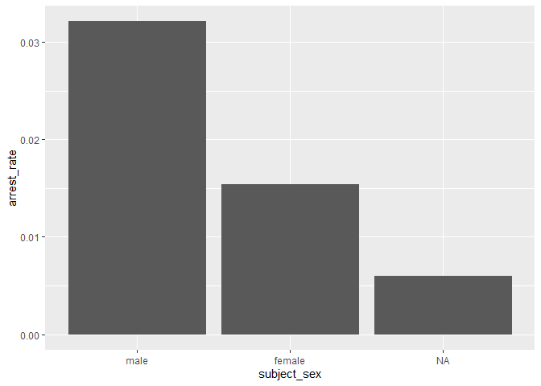
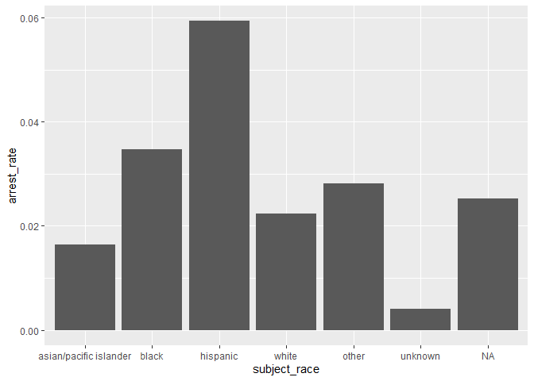
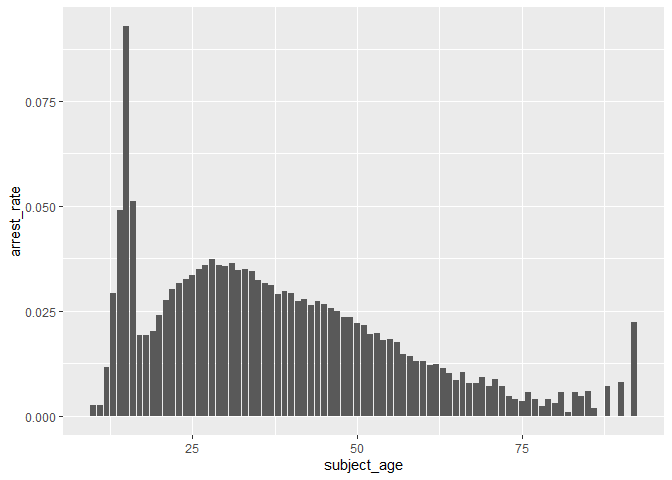
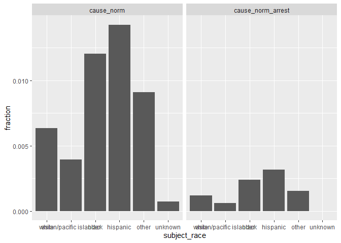

Massachusetts Highway Stops
================
Lily Dao
2023-04-24

- <a href="#grading-rubric" id="toc-grading-rubric">Grading Rubric</a>
  - <a href="#individual" id="toc-individual">Individual</a>
  - <a href="#due-date" id="toc-due-date">Due Date</a>
- <a href="#setup" id="toc-setup">Setup</a>
  - <a
    href="#q1-go-to-the-stanford-open-policing-project-page-and-download-the-massachusetts-state-police-records-in-rds-format-move-the-data-to-your-data-folder-and-match-the-filename-to-load-the-data"
    id="toc-q1-go-to-the-stanford-open-policing-project-page-and-download-the-massachusetts-state-police-records-in-rds-format-move-the-data-to-your-data-folder-and-match-the-filename-to-load-the-data"><strong>q1</strong>
    Go to the Stanford Open Policing Project page and download the
    Massachusetts State Police records in <code>Rds</code> format. Move the
    data to your <code>data</code> folder and match the
    <code>filename</code> to load the data.</a>
- <a href="#eda" id="toc-eda">EDA</a>
  - <a
    href="#q2-do-your-first-checks-on-the-dataset-what-are-the-basic-facts-about-this-dataset"
    id="toc-q2-do-your-first-checks-on-the-dataset-what-are-the-basic-facts-about-this-dataset"><strong>q2</strong>
    Do your “first checks” on the dataset. What are the basic facts about
    this dataset?</a>
  - <a
    href="#q3-check-the-set-of-factor-levels-for-subject_race-and-raw_race-what-do-you-note-about-overlap--difference-between-the-two-sets"
    id="toc-q3-check-the-set-of-factor-levels-for-subject_race-and-raw_race-what-do-you-note-about-overlap--difference-between-the-two-sets"><strong>q3</strong>
    Check the set of factor levels for <code>subject_race</code> and
    <code>raw_Race</code>. What do you note about overlap / difference
    between the two sets?</a>
  - <a
    href="#q4-check-whether-subject_race-and-raw_race-match-for-a-large-fraction-of-cases-which-of-the-two-hypotheses-above-is-most-likely-based-on-your-results"
    id="toc-q4-check-whether-subject_race-and-raw_race-match-for-a-large-fraction-of-cases-which-of-the-two-hypotheses-above-is-most-likely-based-on-your-results"><strong>q4</strong>
    Check whether <code>subject_race</code> and <code>raw_Race</code> match
    for a large fraction of cases. Which of the two hypotheses above is most
    likely, based on your results?</a>
  - <a href="#vis" id="toc-vis">Vis</a>
    - <a
      href="#q5-compare-the-arrest-ratethe-fraction-of-total-cases-in-which-the-subject-was-arrestedacross-different-factors-create-as-many-visuals-or-tables-as-you-need-but-make-sure-to-check-the-trends-across-all-of-the-subject-variables-answer-the-questions-under-observations-below"
      id="toc-q5-compare-the-arrest-ratethe-fraction-of-total-cases-in-which-the-subject-was-arrestedacross-different-factors-create-as-many-visuals-or-tables-as-you-need-but-make-sure-to-check-the-trends-across-all-of-the-subject-variables-answer-the-questions-under-observations-below"><strong>q5</strong>
      Compare the <em>arrest rate</em>—the fraction of total cases in which
      the subject was arrested—across different factors. Create as many
      visuals (or tables) as you need, but make sure to check the trends
      across all of the <code>subject</code> variables. Answer the questions
      under <em>observations</em> below.</a>
- <a href="#modeling" id="toc-modeling">Modeling</a>
  - <a
    href="#q6-run-the-following-code-and-interpret-the-regression-coefficients-answer-the-the-questions-under-observations-below"
    id="toc-q6-run-the-following-code-and-interpret-the-regression-coefficients-answer-the-the-questions-under-observations-below"><strong>q6</strong>
    Run the following code and interpret the regression coefficients. Answer
    the the questions under <em>observations</em> below.</a>
  - <a
    href="#q7-re-fit-the-logistic-regression-from-q6-setting-white-as-the-reference-level-for-subject_race-interpret-the-the-model-terms-and-answer-the-questions-below"
    id="toc-q7-re-fit-the-logistic-regression-from-q6-setting-white-as-the-reference-level-for-subject_race-interpret-the-the-model-terms-and-answer-the-questions-below"><strong>q7</strong>
    Re-fit the logistic regression from q6 setting <code>"white"</code> as
    the reference level for <code>subject_race</code>. Interpret the the
    model terms and answer the questions below.</a>
  - <a
    href="#q8-re-fit-the-model-using-a-factor-indicating-the-presence-of-contraband-in-the-subjects-vehicle-answer-the-questions-under-observations-below"
    id="toc-q8-re-fit-the-model-using-a-factor-indicating-the-presence-of-contraband-in-the-subjects-vehicle-answer-the-questions-under-observations-below"><strong>q8</strong>
    Re-fit the model using a factor indicating the presence of contraband in
    the subject’s vehicle. Answer the questions under <em>observations</em>
    below.</a>
  - <a
    href="#q9-go-deeper-pose-at-least-one-more-question-about-the-data-and-fit-at-least-one-more-model-in-support-of-answering-that-question"
    id="toc-q9-go-deeper-pose-at-least-one-more-question-about-the-data-and-fit-at-least-one-more-model-in-support-of-answering-that-question"><strong>q9</strong>
    Go deeper: Pose at least one more question about the data and fit at
    least one more model in support of answering that question.</a>
  - <a href="#further-reading" id="toc-further-reading">Further Reading</a>

*Purpose*: In this last challenge we’ll focus on using logistic
regression to study a large, complicated dataset. Interpreting the
results of a model can be challenging—both in terms of the statistics
and the real-world reasoning—so we’ll get some practice in this
challenge.

<!-- include-rubric -->

# Grading Rubric

<!-- -------------------------------------------------- -->

Unlike exercises, **challenges will be graded**. The following rubrics
define how you will be graded, both on an individual and team basis.

## Individual

<!-- ------------------------- -->

| Category    | Needs Improvement                                                                                                | Satisfactory                                                                                                               |
|-------------|------------------------------------------------------------------------------------------------------------------|----------------------------------------------------------------------------------------------------------------------------|
| Effort      | Some task **q**’s left unattempted                                                                               | All task **q**’s attempted                                                                                                 |
| Observed    | Did not document observations, or observations incorrect                                                         | Documented correct observations based on analysis                                                                          |
| Supported   | Some observations not clearly supported by analysis                                                              | All observations clearly supported by analysis (table, graph, etc.)                                                        |
| Assessed    | Observations include claims not supported by the data, or reflect a level of certainty not warranted by the data | Observations are appropriately qualified by the quality & relevance of the data and (in)conclusiveness of the support      |
| Specified   | Uses the phrase “more data are necessary” without clarification                                                  | Any statement that “more data are necessary” specifies which *specific* data are needed to answer what *specific* question |
| Code Styled | Violations of the [style guide](https://style.tidyverse.org/) hinder readability                                 | Code sufficiently close to the [style guide](https://style.tidyverse.org/)                                                 |

## Due Date

<!-- ------------------------- -->

All the deliverables stated in the rubrics above are due **at midnight**
before the day of the class discussion of the challenge. See the
[Syllabus](https://docs.google.com/document/d/1qeP6DUS8Djq_A0HMllMqsSqX3a9dbcx1/edit?usp=sharing&ouid=110386251748498665069&rtpof=true&sd=true)
for more information.

*Background*: We’ll study data from the [Stanford Open Policing
Project](https://openpolicing.stanford.edu/data/), specifically their
dataset on Massachusetts State Patrol police stops.

``` r
library(tidyverse)
```

    ## ── Attaching packages ─────────────────────────────────────── tidyverse 1.3.2 ──
    ## ✔ ggplot2 3.4.0      ✔ purrr   1.0.1 
    ## ✔ tibble  3.1.8      ✔ dplyr   1.0.10
    ## ✔ tidyr   1.2.1      ✔ stringr 1.5.0 
    ## ✔ readr   2.1.3      ✔ forcats 0.5.2 
    ## ── Conflicts ────────────────────────────────────────── tidyverse_conflicts() ──
    ## ✖ dplyr::filter() masks stats::filter()
    ## ✖ dplyr::lag()    masks stats::lag()

``` r
library(broom)
library(ggplot2)
```

# Setup

<!-- -------------------------------------------------- -->

### **q1** Go to the [Stanford Open Policing Project](https://openpolicing.stanford.edu/data/) page and download the Massachusetts State Police records in `Rds` format. Move the data to your `data` folder and match the `filename` to load the data.

*Note*: An `Rds` file is an R-specific file format. The function
`readRDS` will read these files.

``` r
## TODO: Download the data, move to your data folder, and load it
filename <- NA_character_
df_data <- readRDS("./data/ma_statewide_2020_04_01.rds")
df_data
```

    ## # A tibble: 3,416,238 × 24
    ##    raw_row_nu…¹ date       locat…² count…³ subje…⁴ subje…⁵ subje…⁶ type  arres…⁷
    ##    <chr>        <date>     <chr>   <chr>     <int> <fct>   <fct>   <fct> <lgl>  
    ##  1 1            2007-06-06 MIDDLE… Plymou…      33 white   male    vehi… FALSE  
    ##  2 2            2007-06-07 SEEKONK Bristo…      36 white   male    vehi… FALSE  
    ##  3 3            2007-06-07 MEDFORD Middle…      56 white   female  vehi… FALSE  
    ##  4 4            2007-06-07 MEDFORD Middle…      37 white   male    vehi… FALSE  
    ##  5 5            2007-06-07 EVERETT Middle…      22 hispan… female  vehi… FALSE  
    ##  6 6            2007-06-07 MEDFORD Middle…      34 white   male    vehi… FALSE  
    ##  7 7            2007-06-07 SOMERV… Middle…      54 hispan… male    vehi… FALSE  
    ##  8 8            2007-06-07 HOPKIN… Middle…      31 hispan… female  vehi… FALSE  
    ##  9 9            2007-06-07 SOMERV… Middle…      21 white   male    vehi… FALSE  
    ## 10 10           2007-06-06 BARNST… Barnst…      56 white   male    vehi… FALSE  
    ## # … with 3,416,228 more rows, 15 more variables: citation_issued <lgl>,
    ## #   warning_issued <lgl>, outcome <fct>, contraband_found <lgl>,
    ## #   contraband_drugs <lgl>, contraband_weapons <lgl>, contraband_alcohol <lgl>,
    ## #   contraband_other <lgl>, frisk_performed <lgl>, search_conducted <lgl>,
    ## #   search_basis <fct>, reason_for_stop <chr>, vehicle_type <chr>,
    ## #   vehicle_registration_state <fct>, raw_Race <chr>, and abbreviated variable
    ## #   names ¹​raw_row_number, ²​location, ³​county_name, ⁴​subject_age, …

# EDA

<!-- -------------------------------------------------- -->

### **q2** Do your “first checks” on the dataset. What are the basic facts about this dataset?

``` r
glimpse(df_data)
```

    ## Rows: 3,416,238
    ## Columns: 24
    ## $ raw_row_number             <chr> "1", "2", "3", "4", "5", "6", "7", "8", "9"…
    ## $ date                       <date> 2007-06-06, 2007-06-07, 2007-06-07, 2007-0…
    ## $ location                   <chr> "MIDDLEBOROUGH", "SEEKONK", "MEDFORD", "MED…
    ## $ county_name                <chr> "Plymouth County", "Bristol County", "Middl…
    ## $ subject_age                <int> 33, 36, 56, 37, 22, 34, 54, 31, 21, 56, 56,…
    ## $ subject_race               <fct> white, white, white, white, hispanic, white…
    ## $ subject_sex                <fct> male, male, female, male, female, male, mal…
    ## $ type                       <fct> vehicular, vehicular, vehicular, vehicular,…
    ## $ arrest_made                <lgl> FALSE, FALSE, FALSE, FALSE, FALSE, FALSE, F…
    ## $ citation_issued            <lgl> TRUE, FALSE, FALSE, FALSE, TRUE, TRUE, TRUE…
    ## $ warning_issued             <lgl> FALSE, TRUE, TRUE, TRUE, FALSE, FALSE, FALS…
    ## $ outcome                    <fct> citation, warning, warning, warning, citati…
    ## $ contraband_found           <lgl> NA, FALSE, NA, NA, NA, NA, NA, NA, NA, NA, …
    ## $ contraband_drugs           <lgl> NA, FALSE, NA, NA, NA, NA, NA, NA, NA, NA, …
    ## $ contraband_weapons         <lgl> NA, FALSE, NA, NA, NA, NA, NA, NA, NA, NA, …
    ## $ contraband_alcohol         <lgl> FALSE, FALSE, FALSE, FALSE, FALSE, FALSE, F…
    ## $ contraband_other           <lgl> NA, FALSE, NA, NA, NA, NA, NA, NA, NA, NA, …
    ## $ frisk_performed            <lgl> NA, FALSE, NA, NA, NA, NA, NA, NA, NA, NA, …
    ## $ search_conducted           <lgl> FALSE, TRUE, FALSE, FALSE, FALSE, FALSE, FA…
    ## $ search_basis               <fct> NA, other, NA, NA, NA, NA, NA, NA, NA, NA, …
    ## $ reason_for_stop            <chr> "Speed", NA, NA, NA, NA, "Speed", NA, NA, N…
    ## $ vehicle_type               <chr> "Passenger", "Commercial", "Passenger", "Co…
    ## $ vehicle_registration_state <fct> MA, MA, MA, MA, MA, MA, MA, MA, MA, MA, MA,…
    ## $ raw_Race                   <chr> "White", "White", "White", "White", "Hispan…

``` r
summary(df_data)
```

    ##  raw_row_number          date              location         county_name       
    ##  Length:3416238     Min.   :2007-01-01   Length:3416238     Length:3416238    
    ##  Class :character   1st Qu.:2009-04-22   Class :character   Class :character  
    ##  Mode  :character   Median :2011-07-08   Mode  :character   Mode  :character  
    ##                     Mean   :2011-07-16                                        
    ##                     3rd Qu.:2013-08-27                                        
    ##                     Max.   :2015-12-31                                        
    ##                                                                               
    ##   subject_age                     subject_race     subject_sex     
    ##  Min.   :10.00    asian/pacific islander: 166842   male  :2362238  
    ##  1st Qu.:25.00    black                 : 351610   female:1038377  
    ##  Median :34.00    hispanic              : 338317   NA's  :  15623  
    ##  Mean   :36.47    white                 :2529780                   
    ##  3rd Qu.:46.00    other                 :  11008                   
    ##  Max.   :94.00    unknown               :  17017                   
    ##  NA's   :158006   NA's                  :   1664                   
    ##          type         arrest_made     citation_issued warning_issued 
    ##  pedestrian:      0   Mode :logical   Mode :logical   Mode :logical  
    ##  vehicular :3416238   FALSE:3323303   FALSE:1244039   FALSE:2269244  
    ##                       TRUE :92019     TRUE :2171283   TRUE :1146078  
    ##                       NA's :916       NA's :916       NA's :916      
    ##                                                                      
    ##                                                                      
    ##                                                                      
    ##      outcome        contraband_found contraband_drugs contraband_weapons
    ##  warning :1146078   Mode :logical    Mode :logical    Mode :logical     
    ##  citation:2171283   FALSE:28256      FALSE:36296      FALSE:53237       
    ##  summons :      0   TRUE :27474      TRUE :19434      TRUE :2493        
    ##  arrest  :  92019   NA's :3360508    NA's :3360508    NA's :3360508     
    ##  NA's    :   6858                                                       
    ##                                                                         
    ##                                                                         
    ##  contraband_alcohol contraband_other frisk_performed search_conducted
    ##  Mode :logical      Mode :logical    Mode :logical   Mode :logical   
    ##  FALSE:3400070      FALSE:51708      FALSE:51029     FALSE:3360508   
    ##  TRUE :16168        TRUE :4022       TRUE :3602      TRUE :55730     
    ##                     NA's :3360508    NA's :3361607                   
    ##                                                                      
    ##                                                                      
    ##                                                                      
    ##          search_basis     reason_for_stop    vehicle_type      
    ##  k9            :      0   Length:3416238     Length:3416238    
    ##  plain view    :      0   Class :character   Class :character  
    ##  consent       :   6903   Mode  :character   Mode  :character  
    ##  probable cause:  25898                                        
    ##  other         :  18228                                        
    ##  NA's          :3365209                                        
    ##                                                                
    ##  vehicle_registration_state   raw_Race        
    ##  MA     :3053713            Length:3416238    
    ##  CT     :  82906            Class :character  
    ##  NY     :  69059            Mode  :character  
    ##  NH     :  51514                              
    ##  RI     :  39375                              
    ##  (Other): 109857                              
    ##  NA's   :   9814

Note that we have both a `subject_race` and `race_Raw` column. There are
a few possibilities as to what `race_Raw` represents:

- `race_Raw` could be the race of the police officer in the stop
- `race_Raw` could be an unprocessed version of `subject_race`

Let’s try to distinguish between these two possibilities.

### **q3** Check the set of factor levels for `subject_race` and `raw_Race`. What do you note about overlap / difference between the two sets?

``` r
## TODO: Determine the factor levels for subject_race and raw_Race

df_data %>%
  pull(subject_race) %>%
  levels()
```

    ## [1] "asian/pacific islander" "black"                  "hispanic"              
    ## [4] "white"                  "other"                  "unknown"

``` r
levels(as.factor(df_data$raw_Race))
```

    ## [1] "A"                                            
    ## [2] "American Indian or Alaskan Native"            
    ## [3] "Asian or Pacific Islander"                    
    ## [4] "Black"                                        
    ## [5] "Hispanic"                                     
    ## [6] "Middle Eastern or East Indian (South Asian)"  
    ## [7] "None - for no operator present citations only"
    ## [8] "White"

**Observations**:

- What are the unique values for `subject_race`?

  The unique values for subject_race are “other” and “unknown”.

- What are the unique values for `raw_Race`?

  The unique values for raw_Race are “A”, “American Indian or Alaskan
  Native”, “Middle Eastern or East Indian (South Asian)”, and “None -
  for no operator present citations only”.

- What is the overlap between the two sets?

  The values that overlap are “asian/pacific islander”, “black”,
  “hispanic”, and “white”.

- What is the difference between the two sets?

  The difference between the two sets is that raw_Race has a few more
  categories like “A”, “American Indian or Alaskan Native”, “Middle
  Eastern or East Indian (South Asian)”. While raw_Race has “None - for
  not operator present citations only”, subject_race has “other” and
  “unknown”.

### **q4** Check whether `subject_race` and `raw_Race` match for a large fraction of cases. Which of the two hypotheses above is most likely, based on your results?

*Note*: Just to be clear, I’m *not* asking you to do a *statistical*
hypothesis test.

``` r
## TODO: Devise your own way to test the hypothesis posed above.
df_data["raw_Race"][df_data["raw_Race"] == "Asian or Pacific Islander"] <- "asian/pacific islander"
df_data["raw_Race"][df_data["raw_Race"] == "American Indian or Alaskan Native"] <- "other"
df_data["raw_Race"][df_data["raw_Race"] == "A"] <- "other"
df_data["raw_Race"][df_data["raw_Race"] == "Middle Eastern or East Indian (South Asian)"] <- "other"
df_data["raw_Race"][df_data["raw_Race"] == "None - for no operator present citations only"] <- "unknown"
df_data$raw_Race <- tolower(df_data$raw_Race)
```

``` r
df_data %>% 
  summarise(raw_Race, subject_race)
```

    ## # A tibble: 3,416,238 × 2
    ##    raw_Race subject_race
    ##    <chr>    <fct>       
    ##  1 white    white       
    ##  2 white    white       
    ##  3 white    white       
    ##  4 white    white       
    ##  5 hispanic hispanic    
    ##  6 white    white       
    ##  7 hispanic hispanic    
    ##  8 hispanic hispanic    
    ##  9 white    white       
    ## 10 white    white       
    ## # … with 3,416,228 more rows

``` r
summary(df_data$subject_race == df_data$raw_Race)
```

    ##    Mode   FALSE    TRUE    NA's 
    ## logical   64550 3350024    1664

**Observations**

Between the two hypotheses:

- `race_Raw` could be the race of the police officer in the stop
- `race_Raw` could be an unprocessed version of `subject_race`

which is most plausible, based on your results?

- It seems that the most plausible hypothesis is that race_Raw is the
  unprocessed version of subject_race. This is because around 97.3% of
  the values match between subject_race and race_Raw after I processed
  race_Raw a bit to fall into the categories of subject_race.

## Vis

<!-- ------------------------- -->

### **q5** Compare the *arrest rate*—the fraction of total cases in which the subject was arrested—across different factors. Create as many visuals (or tables) as you need, but make sure to check the trends across all of the `subject` variables. Answer the questions under *observations* below.

(Note: Create as many chunks and visuals as you need)

``` r
totals_added_sex <-
  df_data %>% 
    group_by(subject_sex, outcome) %>% 
    mutate(n = n()) %>%
    ungroup() %>% 
    group_by(subject_sex) %>% 
    mutate(total = n()) %>% 
    summarise(subject_sex, outcome, n, total) %>% 
    distinct() %>% 
    mutate(arrest_rate = n / total) %>% 
    filter(outcome == "arrest")
```

    ## `summarise()` has grouped output by 'subject_sex'. You can override using the
    ## `.groups` argument.

``` r
totals_added_sex
```

    ## # A tibble: 3 × 5
    ## # Groups:   subject_sex [3]
    ##   subject_sex outcome     n   total arrest_rate
    ##   <fct>       <fct>   <int>   <int>       <dbl>
    ## 1 male        arrest  75920 2362238     0.0321 
    ## 2 female      arrest  16005 1038377     0.0154 
    ## 3 <NA>        arrest     94   15623     0.00602

``` r
totals_added_sex %>% 
  ggplot(mapping = aes(subject_sex, arrest_rate))+
  geom_col()
```

<!-- -->

``` r
totals_added_race <-
  df_data %>% 
    group_by(subject_race, outcome) %>% 
    mutate(n = n()) %>%
    ungroup() %>% 
    group_by(subject_race) %>% 
    mutate(total = n()) %>% 
    summarise(subject_race, outcome, n, total) %>% 
    distinct() %>% 
    mutate(arrest_rate = n / total) %>% 
    filter(outcome == "arrest")
```

    ## `summarise()` has grouped output by 'subject_race'. You can override using the
    ## `.groups` argument.

``` r
totals_added_race
```

    ## # A tibble: 7 × 5
    ## # Groups:   subject_race [7]
    ##   subject_race           outcome     n   total arrest_rate
    ##   <fct>                  <fct>   <int>   <int>       <dbl>
    ## 1 asian/pacific islander arrest   2748  166842     0.0165 
    ## 2 black                  arrest  12225  351610     0.0348 
    ## 3 hispanic               arrest  20085  338317     0.0594 
    ## 4 white                  arrest  56540 2529780     0.0223 
    ## 5 other                  arrest    310   11008     0.0282 
    ## 6 unknown                arrest     69   17017     0.00405
    ## 7 <NA>                   arrest     42    1664     0.0252

``` r
totals_added_race %>% 
  ggplot(mapping = aes(subject_race, arrest_rate))+
  geom_col()
```

<!-- -->

``` r
totals_added_age <-
  df_data %>% 
    group_by(subject_age, outcome) %>% 
    mutate(n = n()) %>%
    ungroup() %>% 
    group_by(subject_age) %>% 
    mutate(total = n()) %>% 
    summarise(subject_age, outcome, n, total) %>% 
    distinct() %>% 
    mutate(arrest_rate = n / total) %>% 
    filter(outcome == "arrest")
```

    ## `summarise()` has grouped output by 'subject_age'. You can override using the
    ## `.groups` argument.

``` r
totals_added_age
```

    ## # A tibble: 81 × 5
    ## # Groups:   subject_age [81]
    ##    subject_age outcome     n total arrest_rate
    ##          <int> <fct>   <int> <int>       <dbl>
    ##  1          10 arrest      1   398     0.00251
    ##  2          11 arrest      1   397     0.00252
    ##  3          12 arrest      3   262     0.0115 
    ##  4          13 arrest      6   206     0.0291 
    ##  5          14 arrest     15   306     0.0490 
    ##  6          15 arrest     44   474     0.0928 
    ##  7          16 arrest    105  2049     0.0512 
    ##  8          17 arrest    338 17513     0.0193 
    ##  9          18 arrest    940 48909     0.0192 
    ## 10          19 arrest   1667 83065     0.0201 
    ## # … with 71 more rows

``` r
totals_added_age %>% 
  ggplot(mapping = aes(subject_age, arrest_rate))+
  geom_col()
```

    ## Warning: Removed 1 rows containing missing values (`position_stack()`).

<!-- -->

**Observations**:

- How does `arrest_rate` tend to vary with `subject_age`?
  - We see that arrest rate peaks around age 15 then dramatically drops
    off around the age of 20. From there, we see a rise in arrest rate
    as someone gets older between around 20 and 27, then we see a steady
    decrease in arrest rate. At over 85 years old, we see another peak,
    but this could be due to the small sample size of older folks that
    were stopped.
- How does `arrest_rate` tend to vary with `subject_sex`?
  - From this data set, we see that the arrest rate is double for males
    than for females for the subject_sex variable. Furthermore, those
    with a recorded subject_sex of NA have less than half the arrest
    rate than females.
- How does `arrest_rate` tend to vary with `subject_race`?
  - We see that the arrest rate is the highest for Hispanic people at
    nearly 6%. The arrest rate for black people follows with around
    3.5%, with other, NA, and white sitting at 2-3%. White,
    Asian/Pacific Islander, and unknown race are lowest three in terms
    of arrest rate. The unknown rate being so low may be due to an
    officer not being present at the time of the stop.

# Modeling

<!-- -------------------------------------------------- -->

We’re going to use a model to study the relationship between `subject`
factors and arrest rate, but first we need to understand a bit more
about *dummy variables*

### **q6** Run the following code and interpret the regression coefficients. Answer the the questions under *observations* below.

``` r
## NOTE: No need to edit; inspect the estimated model terms.
fit_q6 <-
  glm(
    formula = arrest_made ~ subject_age + subject_race + subject_sex,
    data = df_data %>%
      filter(
        !is.na(arrest_made),
        subject_race %in% c("white", "black", "hispanic")
      ),
    family = "binomial"
  )

fit_q6 %>% tidy()
```

    ## # A tibble: 5 × 5
    ##   term                 estimate std.error statistic   p.value
    ##   <chr>                   <dbl>     <dbl>     <dbl>     <dbl>
    ## 1 (Intercept)           -2.67    0.0132      -202.  0        
    ## 2 subject_age           -0.0142  0.000280     -50.5 0        
    ## 3 subject_racehispanic   0.513   0.0119        43.3 0        
    ## 4 subject_racewhite     -0.380   0.0103       -37.0 3.12e-299
    ## 5 subject_sexfemale     -0.755   0.00910      -83.0 0

**Observations**:

- Which `subject_race` levels are included in fitting the model?
  - The subject_race levels included in fitting the model are white,
    black, and hispanic.
- Which `subject_race` levels have terms in the model?
  - The subject_race levels that have terms in the model are hispanic
    and white.

You should find that each factor in the model has a level *missing* in
its set of terms. This is because R represents factors against a
*reference level*: The model treats one factor level as “default”, and
each factor model term represents a change from that “default” behavior.
For instance, the model above treats `subject_sex==male` as the
reference level, so the `subject_sexfemale` term represents the *change
in probability* of arrest due to a person being female (rather than
male).

The this reference level approach to coding factors is necessary for
[technical
reasons](https://www.andrew.cmu.edu/user/achoulde/94842/lectures/lecture10/lecture10-94842.html#why-is-one-of-the-levels-missing-in-the-regression),
but it complicates interpreting the model results. For instance; if we
want to compare two levels, neither of which are the reference level, we
have to consider the difference in their model coefficients. But if we
want to compare all levels against one “baseline” level, then we can
relevel the data to facilitate this comparison.

By default `glm` uses the first factor level present as the reference
level. Therefore we can use
`mutate(factor = fct_relevel(factor, "desired_level"))` to set our
`"desired_level"` as the reference factor.

### **q7** Re-fit the logistic regression from q6 setting `"white"` as the reference level for `subject_race`. Interpret the the model terms and answer the questions below.

``` r
## TODO: Re-fit the logistic regression, but set "white" as the reference
## level for subject_race
df_data$subject_race <- relevel(df_data$subject_race, ref = "white")

fit_q7 <-
    glm(
    formula = arrest_made ~ subject_race + subject_age + subject_sex,
    data = df_data %>%
      filter(
        !is.na(arrest_made),
        subject_race %in% c("white", "black", "hispanic", "other", "asian/pacific islander", "unknown", "NA")
      ),
    family = "binomial"
  )


fit_q7 %>% tidy()
```

    ## # A tibble: 8 × 5
    ##   term                               estimate std.error statistic   p.value
    ##   <chr>                                 <dbl>     <dbl>     <dbl>     <dbl>
    ## 1 (Intercept)                         -3.04    0.0108    -282.    0        
    ## 2 subject_raceasian/pacific islander  -0.389   0.0200     -19.4   7.72e- 84
    ## 3 subject_raceblack                    0.379   0.0103      36.9   7.64e-299
    ## 4 subject_racehispanic                 0.892   0.00859    104.    0        
    ## 5 subject_raceother                   -0.0246  0.0683      -0.360 7.18e-  1
    ## 6 subject_raceunknown                 -1.94    0.315       -6.15  7.82e- 10
    ## 7 subject_age                         -0.0144  0.000277   -52.0   0        
    ## 8 subject_sexfemale                   -0.751   0.00896    -83.8   0

**Observations**:

- Which `subject_race` level has the highest probability of being
  arrested, according to this model? Which has the lowest probability?
  - The subject_race level with the highest probability of being
    arrested (from this model) is Hispanic. The level with the lowest
    probability is unknown, with the lowest probability of a known race
    being Asian/Pacific Islander.
- What could explain this difference in probabilities of arrest across
  race? List **multiple** possibilities.
  - Officer bias
  - Contraband presence
  - Age/sex, since this isn’t fully accounted for
  - County/location
  - Interaction between officer and person stopped
- Look at the sent of variables in the dataset; do any of the columns
  relate to a potential explanation you listed?
  - We have many columns that cover the presence of contraband, we also
    have subject age and sex which we have looked at. Lastly, from my
    list, we have the location of the traffic stop.

One way we can explain differential arrest rates is to include some
measure indicating the presence of an arrestable offense. We’ll do this
in a particular way in the next task.

### **q8** Re-fit the model using a factor indicating the presence of contraband in the subject’s vehicle. Answer the questions under *observations* below.

``` r
## TODO: Repeat the modeling above, but control for whether contraband was found
## during the police stop

fit_q8 <-
    glm(
    formula = arrest_made ~ subject_race + subject_age + subject_sex + contraband_found,
    data = df_data %>%
      filter(
        !is.na(arrest_made),
        subject_race %in% c("white", "black", "hispanic", "other", "asian/pacific islander", "unknown", "NA")
      ),
    family = "binomial"
  )

fit_q8 %>% tidy()
```

    ## # A tibble: 9 × 5
    ##   term                               estimate std.error statistic   p.value
    ##   <chr>                                 <dbl>     <dbl>     <dbl>     <dbl>
    ## 1 (Intercept)                         -1.70    0.0334     -50.8   0        
    ## 2 subject_raceasian/pacific islander  -0.0386  0.0585      -0.660 5.09e-  1
    ## 3 subject_raceblack                   -0.0525  0.0269      -1.95  5.12e-  2
    ## 4 subject_racehispanic                 0.218   0.0237       9.22  2.88e- 20
    ## 5 subject_raceother                   -0.291   0.147       -1.98  4.77e-  2
    ## 6 subject_raceunknown                -10.8    49.0         -0.221 8.25e-  1
    ## 7 subject_age                          0.0219  0.000851    25.7   2.71e-145
    ## 8 subject_sexfemale                   -0.311   0.0254     -12.3   1.25e- 34
    ## 9 contraband_foundTRUE                 0.603   0.0189      31.9   1.76e-223

**Observations**:

- How does controlling for found contraband affect the `subject_race`
  terms in the model?

  When we are controlling for contraband found, we see that the
  probability of arrest for each race decreases except for Asian/Pacific
  Islander. It seems that when we are controlling for contraband, it is
  when contraband found. This makes sense since when we see filter that
  contraband is not found, we should see less arrests across the board.

- What does the *finding of contraband* tell us about the stop? What
  does it *not* tell us about the stop?

  The finding of contraband tells us that the person stopped was
  searched. It also tells us that there was a basis for the search.
  Whether this is a valid basis or not is something we don’t know.
  Finding of contraband also indicates that there was an officer present
  to find the contraband.

### **q9** Go deeper: Pose at least one more question about the data and fit at least one more model in support of answering that question.

``` r
fit_q9 <-
    glm(
    formula = arrest_made ~ subject_race + subject_age + subject_sex + search_conducted,
    data = df_data %>%
      filter(
        !is.na(arrest_made),
        subject_race %in% c("white", "black", "hispanic", "other", "asian/pacific islander", "unknown", "NA")
      ),
    family = "binomial"
  )

fit_q9 %>% tidy()
```

    ## # A tibble: 9 × 5
    ##   term                               estimate std.error statistic   p.value
    ##   <chr>                                 <dbl>     <dbl>     <dbl>     <dbl>
    ## 1 (Intercept)                        -3.43     0.0113     -302.   0        
    ## 2 subject_raceasian/pacific islander -0.330    0.0203      -16.3  1.99e- 59
    ## 3 subject_raceblack                   0.306    0.0107       28.8  6.40e-182
    ## 4 subject_racehispanic                0.811    0.00900      90.1  0        
    ## 5 subject_raceother                  -0.151    0.0703       -2.15 3.18e-  2
    ## 6 subject_raceunknown                -1.85     0.315        -5.86 4.62e-  9
    ## 7 subject_age                        -0.00903  0.000283    -31.9  1.66e-223
    ## 8 subject_sexfemale                  -0.659    0.00912     -72.3  0        
    ## 9 search_conductedTRUE                2.87     0.0101      283.   0

**Observations**:

- I was asking the question: How does search being conducted or not
  affect the probability of arrest for different races or sexes compared
  to search not being factored in?
- By looking at this model and comparing the values to the model without
  search being factored in, I noticed that not much had changed. I
  noticed that the “other” race category has a lower probability of race
  by over 0.1. The female sex category has a slightly higher probability
  of arrest with the search being factored in increasing by around 0.1.
  When search is factored in, the probability of arrest for the other
  categories is not notably changed. That being said, we do see that
  when a search is conducted, the probability of arrest is significantly
  higher for that factor than any of the other factors.

Just an interesting graph plotting the normalized value of probable
cause search basis instances vs. race and an normalized value of
probable cause search base instances that also led to arrest vs. race.

``` r
# Graph showing the searches on the basis of "probable cause" normalized by all stops vs. race. 
df_graph <-
  df_data %>% 
    group_by(subject_race) %>% 
    summarise(
      n_prob_cause = sum(search_basis == 'probable cause', na.rm = TRUE),
      n_total = n(),
      n_prob_cause_arrest = sum(search_basis == 'probable cause'& outcome == "arrest", na.rm = TRUE)
    ) %>% 
    mutate(cause_norm = n_prob_cause/n_total) %>% 
    mutate(cause_norm_arrest = n_prob_cause_arrest/n_total) %>% 
    filter(!row_number() %in% c(7)) %>% 
    pivot_longer(
      cols = c(cause_norm, cause_norm_arrest),
      names_to = c("quantity"),
      values_to = c("fraction")
    )
df_graph
```

    ## # A tibble: 12 × 6
    ##    subject_race           n_prob_cause n_total n_prob_cause_ar…¹ quant…² fract…³
    ##    <fct>                         <int>   <int>             <int> <chr>     <dbl>
    ##  1 white                         16018 2529780              3020 cause_… 6.33e-3
    ##  2 white                         16018 2529780              3020 cause_… 1.19e-3
    ##  3 asian/pacific islander          657  166842                99 cause_… 3.94e-3
    ##  4 asian/pacific islander          657  166842                99 cause_… 5.93e-4
    ##  5 black                          4240  351610               836 cause_… 1.21e-2
    ##  6 black                          4240  351610               836 cause_… 2.38e-3
    ##  7 hispanic                       4823  338317              1071 cause_… 1.43e-2
    ##  8 hispanic                       4823  338317              1071 cause_… 3.17e-3
    ##  9 other                           100   11008                17 cause_… 9.08e-3
    ## 10 other                           100   11008                17 cause_… 1.54e-3
    ## 11 unknown                          12   17017                 0 cause_… 7.05e-4
    ## 12 unknown                          12   17017                 0 cause_… 0      
    ## # … with abbreviated variable names ¹​n_prob_cause_arrest, ²​quantity, ³​fraction

``` r
df_graph %>% 
  ggplot() +
  geom_col(mapping = aes(subject_race, fraction))+
  facet_wrap(~ quantity)
```

<!-- -->

## Further Reading

<!-- -------------------------------------------------- -->

- Stanford Open Policing Project
  [findings](https://openpolicing.stanford.edu/findings/).
